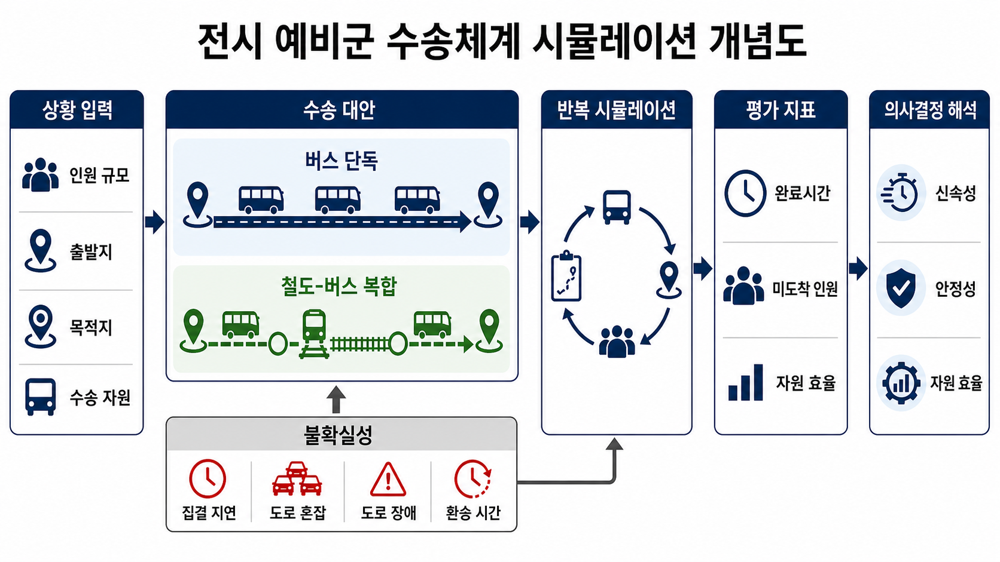
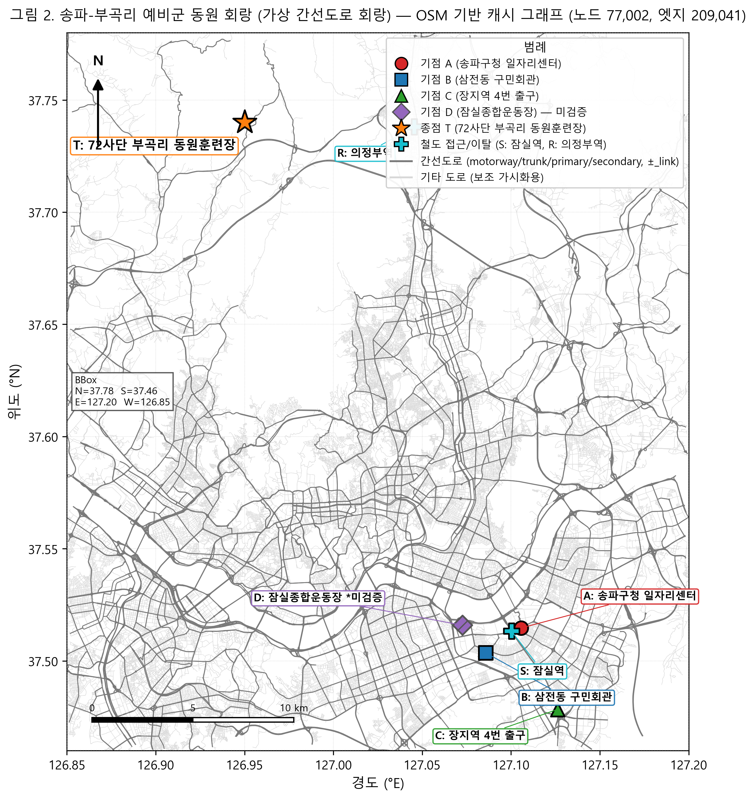
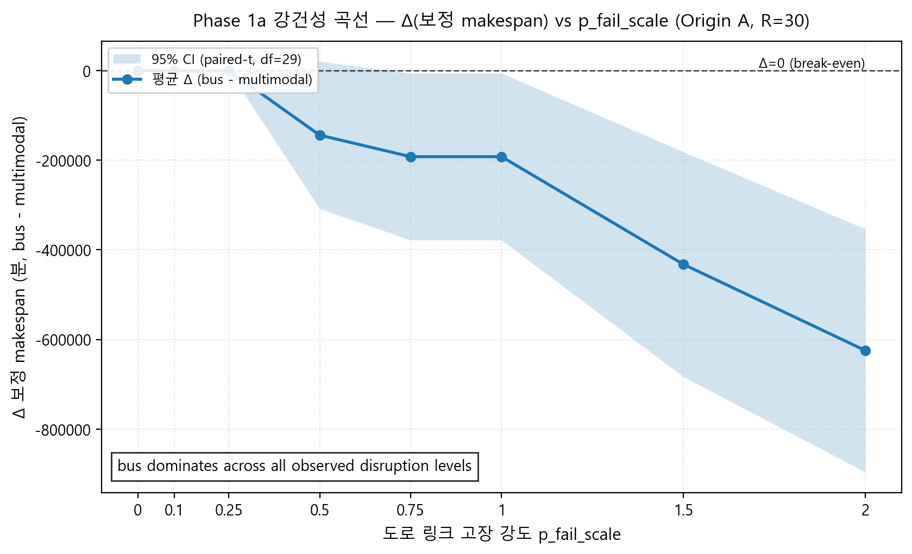
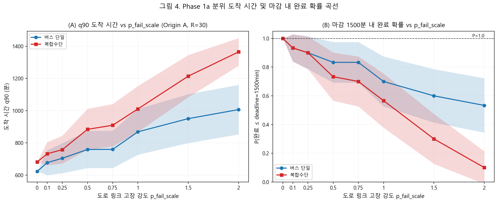
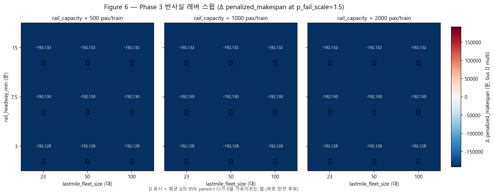

# 예비군 동원수송 회랑에서 복합수단 적용 조건 식별 — 송파↔양주 부곡리 사례를 중심으로

**초록.** 예비군 동원수송은 대규모 인원을 마감 내 훈련장까지 이동시켜야 하나, 운영 자료 제한으로 단일수단(직행버스)과 복합수단(철도-버스)의 상대 강건성은 외부 연구자에게 검증되어 있지 않다. 본 연구는 break-even 탐색을 *적용 조건 식별(applicability-condition identification)* 로 재포지셔닝하여, 송파↔양주 부곡리 회랑에서 복합수단 우위 조건의 존재 여부를 검정한다. OSMnx 기반 SimPy 시뮬레이터를 4단계 실험(Phase 1a 기준, 1b 원점, 2 단일수단 튜닝, 3 반사실 레버 스윕)으로 평가하며, 셀당 동일 seed로 도로 장애·도착·배경 교통을 등화하는 페어드 공통난수(paired CRN)를 적용한다. 핵심 KPI는 검열 인식 벌점 메이크스팬과 분위 도착 KPI이며, Morris 민감도(k = 14, T = 100, 1,500 평가)와 반사실 레버 스윕을 결합한다. 부호 규약 Δ = bus_only − multimodal (음수 = 직행버스 우위) 하에서 Phase 1a는 p_fail = 0.0에서 Δ = **−58.5분**, p_fail = 2.0에서 Δ P(완료 ≤ 1500분) = **+0.433** [95% CI +0.245, +0.622]를 보인다. Phase 3의 **81셀 중 multi_dominant 셀은 0개**(bus_dominant 54, inconclusive 27)이며, Morris 상위 3개는 passenger_volume (μ* = **44.5**), direct_bus_fleet_size (**27.4**), dispatch_interval (**20.8**)로 모두 공급측 자원 모수이다. 검토 공간 내 복합수단 적용 조건은 부재하며, 미보정 계획 프록시 조건도 내에서 통계적으로 검정된 정의된 negative result로 보고된다.

**주제어.** 반사실 레버 스윕; 페어드 공통난수; 분위 도착 KPI; 예비군 동원; 철도-버스 복합수단

---

## 1. 서론

### 1.1. 연구 배경

대한민국의 국방태세는 상비전력과 예비전력의 통합 운용을 전제로 한다. 「병역법」 및 「예비군법」에 따라 편성되는 예비군은 전시·사변·국가비상사태 시 신속히 동원되어 전방 보충 및 후방 방어 임무를 수행하는 핵심 인적자원이다 [1]. 병무청 공개 자료에 따르면 동원지정 인력은 「병력동원소집통지서」를 통해 개별 통지된 시각·장소에 입영하며, 72보병사단 부곡리 동원훈련장(경기 양주 장흥 부곡리 산 6-17)을 비롯한 전국의 동원사단 훈련장이 그 입영 거점으로 운용된다 [2]. 동원훈련은 2박 3일 일정이며 12시 정시 입영을 기준으로 1시간의 지연입소 허용 시한이 공시되어 있다 [2].

이러한 동원 절차의 실효성은 평상시 행정 동원 단계에서뿐 아니라 전시 도로망이 부분적으로 손상되거나 통제되는 상황에서 더욱 중요하게 부각된다. 수도권 남동부에서 경기 북부 동원훈련장으로 연결되는 회랑은 올림픽대로, 강변북로, 서울외곽순환고속도로 등 소수의 주요 간선도로에 의존한다. 이 간선도로 망은 평시에도 출퇴근 시간 정체와 사고로 인한 단발성 통행 차단에 취약하며, 전시 또는 대규모 재난 시에는 그 취약성이 더욱 증폭될 수 있다 [3, 4]. 〈그림 1〉은 본 연구가 가정하는 전시 예비군 수송체계의 개념도로, 도시 집결지(송파구 내 가상 출발지)에서 동원훈련장(72보병사단 부곡리)까지의 단일수단 버스 직송과 철도-버스 복합수단 환승의 두 가지 대안적 수송체계를 도식화한다.



*그림 1.* 전시 예비군 수송체계 시뮬레이션 개념도. 송파구 가상 집결지(A·B·C·D)에서 출발하는 단일수단 버스 직송과 철도-버스 복합수단 환승의 두 대안적 수송체계를, 72보병사단 부곡리 동원훈련장까지의 주요 간선도로 회랑 위에서 도식화한다. (자료원: 본 연구 자체 작성, `figure1_concept.png`)

본 연구는 송파구 내 네 개 가상 집결지로부터 양주시 장흥면 부곡리에 위치한 72보병사단 동원훈련장에 이르는 약 40~50 km의 주요 간선도로 회랑을 분석 대상으로 한다. 집결지(Origin) A·B·C는 각각 송파구청 일자리센터 앞(37.5147 N, 127.1057 E), 삼전동 구민회관 앞(37.5036 N, 127.0857 E), 장지역 4번 출구 앞(37.4784 N, 127.1262 E)으로 송파구 조례 및 보도자료에서 공개적으로 확인되는 예비군 수송버스 집결지이다 [5, 6]. 단, 해당 집결지들은 평시 예비군훈련용으로 지정된 지점이며 동원훈련 집결지 지정 여부는 공개 자료로 확인되지 않으므로, 본 연구에서는 이를 동원훈련 수송 시나리오에 가상으로 적용한다. 추가로 (D) 잠실종합운동장(37.5159 N, 127.0727 E)은 도시계획상의 대규모 집결 가능 공간으로서 비교 시나리오에 포함하되, 「병력동원 집결지」로서의 공식 지정 여부가 공개 자료에서 확인되지 않으므로 본 논문에서는 "출처 미확인 가정 변형(unverified illustrative variant) (비검증)"으로 명시한다(상세 caveat은 §4.2 참조).

### 1.2. 문제 인식

동원 수송체계의 회복력(resilience)을 정량적으로 평가하려면 (i) 평시 운용 실적 자료, (ii) 도로망의 시간대별 용량·자유속도, (iii) 철도·버스 환승 시각표, (iv) 동원지정 자원의 행정구역별 배정 정보가 모두 확보되어야 한다. 그러나 한국에서 이들 자료 중 다수는 보안상의 사유로 공개 범위가 제한되어 있다. 특히 동원지정 자원의 행정구역별 배정은 「병력동원소집통지서」로 개별 고지되며 공개 자료로 검증할 수 없고 [2], 사단별 실제 수송 실적·통과 시간 자료 역시 공개되지 않는다. 이러한 정보 비대칭은 군사적 의의가 큰 동원 수송 문제임에도 불구하고, 외부 연구자의 정량적 의사결정 지원 분석을 제한하는 구조적 제약이 된다.

또한 도로망 장애 시 단일수단(버스 직송)과 복합수단(철도-버스 연계)의 상대적 신뢰성은 사전 직관에 의해 단정하기 어렵다. 일반적으로 복합수단은 환승 손실과 일정 의존성이라는 비용을 수반하지만, 도로 일부 구간이 차단되었을 때 우회 경로를 제공한다는 장점을 갖는다 [7]. 반대로 단일수단은 환승 손실이 없으나 회랑이 차단되면 전체 시스템이 한꺼번에 영향을 받는다. 두 대안의 비교 우위는 (a) 장애의 강도와 빈도, (b) 가용 차량·열차 자원, (c) 출발 정책(엄격 출발 STRICT vs 유예 출발 GRACE), (d) 집결 지연 분포에 따라 가변적이다. 따라서 어느 한 수단을 일률적으로 권고하기보다는, 어떤 조건에서 어느 수단이 우위에 있는가를 보여 주는 "조건 지도(condition map)"가 의사결정자에게 더 유용한 산출물이 된다 [8, 9].

이 같은 문제의식 위에서, 본 연구는 산업공학 방법론을 적용하여 실 데이터 보정 없이도 회복력 평가의 정량적 기반을 제시하고자 한다. 구체적으로 (i) 통제실험 설계(controlled experiment design)를 통해 모형 외 잡음의 영향을 제거하고, (ii) censoring-aware 지표 체계를 통해 시한 내 미도착 인원을 일급(first-class) 결과로 다루며, (iii) 민감도 분석을 통해 결과의 강건성과 주요 인자를 식별한다. 본 연구가 사용하는 도로 용량·자유속도·차량 수·헤드웨이·환승 시간 등의 모수는 모두 공개된 계획 가정에 근거한 값이며, 실세계 보정은 후속 연구의 과제로 명시적으로 유보한다.

### 1.3. 연구 질문 및 가설

본 연구의 v0.6 기준 분석은 송파↔부곡리 회랑에서 단일수단 버스 직송이 모든 현실적 도로 장애 강도(차단율 0~30%) 구간에서 철도-버스 복합수단을 우위로 압도하며, 두 수단의 성과 곡선이 교차하는 break-even 지점이 base 모수 영역 안에서 발견되지 않음을 확인하였다. 이 결과는 본 회랑의 지리적 구조에서 기인한다. 복합수단은 두 개의 도로 구간 — 출발지(A)에서 송파구청·광운대 환승점(S)에 이르는 약 12 km의 도시 간선과 양주역(R)에서 부곡리(D)에 이르는 약 30 km의 마지막 구간 — 을 노출시키는 반면, 직송 버스는 단일한 A→D 도로 구간만을 노출시킨다. 즉 이 회랑에서 철도는 잉여(redundancy)가 아니라 누적되는 추가 위험(added risk)으로 작용한다.

이러한 관찰을 바탕으로 본 연구는 연구 질문을 "어느 수단이 더 회복력 있는가"에서 "어떤 조건에서 복합수단이 경쟁력을 갖게 되는가"로 재정의한다. 즉 단순한 우위 비교 대신, 복합수단을 경쟁 가능 영역으로 끌어올리기 위해 어떤 인프라·운용 모수가 어느 수준으로 변화하여야 하는지를 식별하는 조건 지도(condition map)를 산출하는 것을 본 연구의 핵심 목표로 삼는다. 이를 다음의 작업가설로 정식화한다.

> *송파→부곡리(72보병사단) 예비군 동원 회랑에서, 철도-버스 복합수단이 직송 버스에 대해 경쟁력을 갖게 되는 인프라/모수 조건은 무엇인가?*

이 가설을 다음 세 가지 연구 질문(RQ)으로 분해한다.

**RQ1 (기준 강건성).** 송파↔부곡리 회랑에서 직송 버스 수단은 도로 링크 장애 강도가 증가할 때 어느 정도까지 강건하게 시한 내 입영을 보장하는가? (Phase 1 기준선)

**RQ2 (단일수단 튜닝의 효과).** 차량 대수(fleet size)와 배차 간격(dispatch interval) 등 단일수단 내부 운용 모수의 조정만으로 회복력 frontier를 어느 정도 이동시킬 수 있는가? (Phase 2 정책 sweep)

**RQ3 (반사실 조건 지도, 핵심 기여).** 철도 헤드웨이, 마지막 구간 셔틀 대수, 철도 1열차 수송용량의 어떤 반사실(counterfactual) 모수 조합에서 복합수단이 직송 버스와 경쟁 가능 영역에 진입하는가? 즉, 어떤 인프라 투자 임계점에서 modal preference가 뒤집히는가? (Phase 3 lever sweep)

### 1.4. 연구 의의 및 기여

본 연구의 기여는 군사학과 산업공학의 학제간 위치 위에서 다음과 같이 정리된다.

**첫째, 학제간 의의.** 군 동원 수송 문제는 전통적으로 군사 운용 분석(Operations Analysis)의 영역에 속하였으나, 그 분석 자료의 공개 제약이 외부 연구자의 정량적 검증을 제한하여 왔다 [12]. 본 연구는 실 데이터 보정 없이도 산업공학의 통제실험 설계와 시뮬레이션 방법론을 통해 의사결정 지원의 정량적 기반을 마련할 수 있음을 보인다. 이는 군사학 연구에 산업공학적 엄밀성을 도입하는 동시에, 산업공학 연구에 국방 도메인의 실질적 문제 영역을 제공하는 양방향 기여를 갖는다.

**둘째, 시뮬레이션 기반 의사결정지원 프레임워크.** 본 연구가 제시하는 paired CRN + censoring-aware 지표 + Morris + 2단계 DoE 결합 프레임워크는 특정 회랑이나 특정 사단에 국한되지 않고, 다른 군사 수송 문제(전시 후송, 장비 후속 수송, 민·관·군 협동 작전 등)에 재적용 가능한 일반 구조를 갖는다. 특히 본 연구의 핵심 기여는 두 수단의 단순 우열 판정이나 break-even 지점 식별이 아니라, 복합수단이 직송 수단에 대해 경쟁력을 갖게 되는 인프라·운용 모수 임계 조합을 식별하는 조건 지도(condition map) — 즉 적용가능성 조건 지도 — 의 산출이다. 이러한 산출물은 단일 권고에 비해 의사결정자에게 더 큰 유연성을 제공하며, 인프라 투자 우선순위 판단의 정량적 근거로 활용될 수 있다.

**셋째, 공개 자료 기반 분석 원칙.** 본 연구는 병무청이 공식적으로 공개한 동원훈련장 주소·규정, 송파구 조례·보도자료를 통해 확인되는 집결지 정보, OpenStreetMap에서 추출한 도로망 위상(topology)만을 입력으로 사용한다. 군사 시설의 내부 배치, 부대 정원, 동원지정 자원의 행정구역별 배정 등 비공개 정보는 분석 대상에서 의도적으로 배제한다. 이러한 공개 자료 기반 원칙은 군 기관의 보안성 검토 절차와 양립 가능하며, 학술 커뮤니티의 검증 가능성을 보장한다.

**넷째, 후속 보정 연구의 기반.** 본 연구의 가상 회랑 결과는 단일 권고가 아닌 조건 지도이므로, 향후 실 도로 용량, 실 철도 시각표, 실 동원지정 자원 배정 자료가 보정 단계에서 확보될 경우, 동일한 실험 골격 위에서 결과를 갱신하고 정밀화할 수 있다. 본 연구는 그 보정 단계로 가는 방법론적 발판을 제공한다.

### 1.5. 연구 범위 및 한정 사항

연구 범위와 한정 사항은 본문 5장(논의 및 결론)에서 다시 정리하되, 다음 사항은 서론에서 미리 명시한다. 첫째, 본 연구가 분석하는 송파↔부곡리 회랑은 가상 사례이다. 실제 송파구 거주 동원 자원이 72보병사단으로 배정되는지의 여부는 공개 자료로 검증할 수 없으며, 본 연구는 이를 "예시적(illustrative)" 회랑으로 다룬다. 둘째, 도로 용량·자유속도·차량 수·헤드웨이·환승 시간·철도 시각표는 모두 공개된 계획 가정이며, 실 측정값으로 보정되지 않았다. 셋째, 본 연구의 산출물은 운용 경로 계획이나 부대 운용 지침이 아니라, 산업공학 방법론을 통해 도출된 조건 지도이다.

### 1.6. 논문의 구성

본 논문은 다음과 같이 구성된다. 2장에서는 동원·재난 수송과 다중수단 회복력 평가에 관한 선행연구를 검토하고, 산업공학·운영연구(OR) 문헌에서 제시된 통제실험 설계와 censoring-aware 평가 도구의 적용 사례를 정리한다. 3장에서는 연구 방법으로 (i) 시뮬레이터 구조, (ii) 송파↔양주 부곡리 가상 회랑의 네트워크 구성, (iii) 4단계 paired CRN 실험설계, (iv) censoring-aware 성과 지표 체계, (v) Morris 민감도 분석을 설명한다. 특히 §3.5.4에서 제시되는 Phase 3 반사실 lever sweep(철도 헤드웨이, 마지막 구간 셔틀 대수, 철도 수송용량의 결합 sweep)이 본 연구의 헤드라인 분석에 해당하며, 그 결과는 〈그림 6〉의 조건 지도와 〈표 6〉의 임계 조합 요약으로 제시된다. 4장에서는 결과를 4.1(기준선), 4.2(출발지 강건성), 4.3(단일수단 튜닝), 4.4(반사실 조건 지도, 헤드라인), 4.5(Morris 민감도), 4.6(종합)의 순서로 제시한다. 5장에서는 결과의 군사적 함의, 의사결정 시사점, 본 연구의 한계, 그리고 실 데이터 보정을 향한 후속 연구의 방향을 논의한다.

## 2. 문헌 검토

본 절은 (1) 군 동원 및 인적자원 수송, (2) 재난·복구 시 도로망 신뢰성과 우선순위화, (3) 이산사건 시뮬레이션을 활용한 수송체계 분석, (4) 분산 감소 기법으로서의 짝지은 공통 난수(paired CRN), (5) 검열(censoring)을 반영한 수송 성과지표, (6) Morris 기초효과(elementary effects) 민감도 분석, (7) OSMnx 기반 도로망 추출, (8) 운영과학에서의 손익분기 분석을 차례로 검토한다. 각 갈래는 본 연구의 방법론 기둥(연구계획 §5)과 직접 연결된다. 인용 번호는 본 통합 원고의 §「참고문헌」 전역 번호 체계를 따른다.

### 2.1 군 동원 및 인적자원 수송 연구

군 동원(mobilization) 수송은 평시 대중교통 분석과 다르게 (i) 짧은 시간창(time window) 안에 대규모 인원을 정해진 집결지로 이동시켜야 하며, (ii) 미도착 인원의 비용이 평균 도착시간 증가보다 비대칭적으로 크고, (iii) 도로·철도 일부 구간의 사용 가능성이 평시와 다르다는 특성을 가진다. 국내 예비군 동원체계의 운영 골격(2박 3일 동원훈련, 12:00 입영 및 1시간 지연입소 허용 등)은 병무청이 공개하고 있으며 [1], 송파구를 비롯한 자치구는 「예비군 수송버스 운행 조례」를 통해 집결지·차량 운영의 행정 절차를 규정한다 [2]. 다만 행정구역별 동원지정 자원 배치는 「병력동원소집통지서」로 개별 고지되어 공개 자료로는 검증할 수 없는 한계가 있다.

국제적으로는 군 동원과 직접 비교 가능한 사례가 제한적이어서, 본 연구는 인접 문헌인 대규모 대피·소개(evacuation) 연구를 보조적으로 참고한다. Murray-Tuite와 Wolshon[3]은 도시 대피 모형의 수송수단·시간·정책 차원을 종합적으로 정리하였고, Liu 등[4]은 시간창 제약 하의 단계적 대피(staged evacuation)를 시뮬레이션으로 평가하였다. 두 문헌 모두 (i) "도착시간 평균"만으로는 미도착 위험을 평가할 수 없고, (ii) 정책 변경(시간창, 출발 규칙)이 수송수단 선택보다 큰 효과를 낼 수 있음을 보고한다는 점에서 본 연구의 검열 인식 지표 및 STRICT/GRACE 정책 비교와 동일한 문제의식을 공유한다. 다만 대피 문헌의 결과를 군 동원에 직접 일반화하는 것은 부적절하며, 본 연구는 이를 방법론적 참고로만 활용한다.

### 2.2 재난·복구 시 도로망 신뢰성 및 우선순위화

도로망의 신뢰성·취약성(reliability/vulnerability) 연구는 단일 간선의 차단 또는 용량 저하가 망 전체의 통행시간과 접근성에 미치는 영향을 정량화하는 분야로 발전해 왔다. Berdica[5]는 도로망 취약성을 "사회적 사용성(serviceability)의 변화 가능성"으로 정의하면서, 평시 신뢰성 측정과 비상시 취약성 평가를 구분할 것을 제안하였다. Jenelius 등[6]은 단일 링크 제거 후의 일반화 통행비용 증가를 "중요도(importance)" 지표로 활용하여, 적은 수의 간선이 망 전체 비용에 비대칭적으로 큰 영향을 미친다는 사실을 보였다. Taylor[7]는 접근성 손실(accessibility loss) 기반 지표가 단순 거리 기반 지표보다 사회·경제적 영향을 더 직접적으로 반영한다고 주장하였다.

군사·재난 맥락에서는 망 전체의 일반 통행이 아니라 "특정 OD 쌍의 시간 내 도달 가능성"이 결정적이다. Mattsson과 Jenelius[8]는 신뢰성·취약성 문헌을 종합하면서, 정책 결정에 사용 가능한 지표 집합으로 ① 우회 통행시간, ② 단절된 OD 쌍 비율, ③ 잔여 용량 기반 V/C, ④ 대안 경로 가용성을 제시한다. 본 연구의 접근성 손실 진단(연구계획 §6.4)과 짝지은 회랑(corridor) 차단 시나리오는 이러한 OD 중심 평가 전통에 부합한다.

### 2.3 이산사건 시뮬레이션 기반 수송체계 분석

이산사건 시뮬레이션(discrete-event simulation, DES)은 차량·승객·정류장·환승점을 명시적인 자원(resource)과 사건(event)으로 모형화하는 데 적합한 패러다임이다. Law[9]는 DES 기반 운영 연구의 입력 모형, 출력 분석, 분산 감소 기법을 표준적으로 정리하였으며, Banks 등[10]은 시스템 사용·자원 경합·대기열 길이를 핵심 출력으로 다루는 DES 설계 원칙을 제시하였다.

Python 생태계에서는 SimPy[11]가 가장 널리 사용되는 프로세스 기반 DES 프레임워크로 자리잡았다. SimPy는 차량 함대(fleet)를 `Resource`로, 승객을 `Process`로 표현하여 유한 자원·대기·환승·재시도와 같은 본 연구의 핵심 동학을 직접 표현할 수 있게 한다. Boeing과 Wang[12]은 도로망 그래프를 NetworkX로 표현한 뒤 SimPy 등 외부 시뮬레이터와 결합해 도시 수송 시나리오를 평가하는 워크플로우의 실용성을 보였다. 본 연구는 이러한 결합(OSMnx → NetworkX → SimPy-스타일 도메인 모형)을 그대로 차용하되, 군 동원 맥락에 맞도록 마감시각(time horizon) 제약과 검열 인식 지표를 추가한다.

### 2.4 짝지은 공통 난수(Paired Common Random Numbers)

분산 감소(variance reduction)는 시뮬레이션 출력의 신뢰구간을 좁히기 위한 표준 기법군이며, 그 중 공통 난수(common random numbers, CRN)는 서로 다른 시스템 구성(여기서는 버스 단일 수단 대 철도-버스 복합 수단)을 같은 외생 확률 표본(arrival 시간, 도로 차단 표본, 배경 교통량 등)에 대해 동시에 평가함으로써 비교의 분산을 줄이는 방법이다. Glasserman과 Yao[13]는 CRN이 양(positive)의 효과를 보장받기 위한 충분 조건(단조성·동일성)을 형식화하였고, Law[9]는 짝지은 비교(paired-t) 신뢰구간을 CRN 적용의 표준 출력 분석으로 권고한다. Nakayama[14]는 추정량 단조성이 깨질 수 있는 시나리오에서 CRN의 효과 검정 방법을 정리한다.

본 연구는 모든 외생 표본(도착 분포 표본, 차단 표본, BPR 배경 통행량 표본)을 시드(seed) 단위로 기록하고, 두 수단 시나리오를 동일한 시드 집합에 대해 짝지어 실행하여 짝지은 차이의 신뢰구간과 손익분기 보간을 산출한다. 이는 [13]·[9]가 제시한 정통적인 적용 형태이며, 군 수송체계 비교 연구의 통계적 엄밀성을 강화한다.

### 2.5 검열(Censoring)을 반영한 수송 성과지표

평균 또는 중위 완료시간만으로 수송체계를 평가할 경우, 시간창 내에 도착하지 못한 인원(미도착·검열된 관측치)이 평균 계산에서 묵시적으로 제거되어 "빠르지만 누락이 큰" 시스템이 과대평가되는 편향이 발생한다. 이러한 우편 검열(right-censoring) 문제는 본래 생존분석(survival analysis)에서 정밀하게 다루어진 주제이다. Kaplan과 Meier[15]의 생존함수 추정량은 검열된 관측치를 명시적으로 반영하여 사건 발생률을 추정하며, Klein과 Moeschberger[16]는 검열 메커니즘이 생략될 때의 편향을 체계적으로 정리한다.

운영연구·일정관리 문헌에서는 동일한 문제의식이 "벌점 메이크스팬(penalized makespan)" 또는 "마감시각 위반 비용" 형태로 등장한다. Pinedo[17]는 마감시각 제약 하의 작업 일정 모형에서 makespan과 누적 지연(total tardiness)을 분리해 보고할 것을 권고하며, Hall과 Posner[18]는 마감시각 위반이 평균 통계에 미치는 비대칭 효과를 분석한다. 본 연구는 (i) 완료시간 중위·평균, (ii) 미도착률(miss-rate), (iii) 미도착자에 마감시각을 부여하여 합산한 벌점 메이크스팬을 동시 보고함으로써 [15]–[18]의 권고를 군 수송체계 평가에 적용한다.

### 2.6 Morris 기초효과 민감도 분석

다인자 시뮬레이션의 매개변수가 결과에 미치는 영향을 체계적으로 평가하기 위해서는 정식 민감도 분석이 필요하다. Sobol' 지수[19]가 분산 분해 기반의 정량적 영향력을 제공하지만 계산 비용이 크기 때문에, 사전 선별(screening) 단계에서는 Morris의 기초효과(elementary effects) 설계[20]가 표준이다. Morris 설계는 모수 공간을 격자(trajectory)로 탐색하면서 각 모수의 평균 절대 효과(μ\*)와 표준편차(σ)를 산출하여 (i) 주효과의 크기와 (ii) 비선형성·상호작용의 존재 여부를 동시에 진단한다. Campolongo 등[21]은 원래의 Morris 설계를 개선한 균등분포 기반 trajectory 생성 및 μ\* 지표를 제안하였고, 이는 이후 표준 구현의 기본형이 되었다.

Python에서는 SALib[22]가 Morris·Sobol'·FAST·PAWN 등 주요 민감도 방법을 모듈화한 라이브러리로 자리잡았으며, 본 연구는 이를 사용하여 도로 차단 확률, 용량 감소 깊이, 함대 규모, 배차 간격, 환승 지연, 철도 배차 간격, 집결 지연 분포 등 14개 모수에 대해 Morris μ\*·σ를 산출한다. Morris 결과는 본 연구의 두 단계(Phase 1·2) 실험 설계가 결과에 가장 큰 영향을 주는 모수를 우선적으로 다루었는지를 사후적으로 검증하는 역할을 한다.

> **방법론 주석.** §4.5에서 보고되는 Morris 기초효과 상위 3개 모수 순위는 §3.7에 정의된 *정규(canonical) 다중지표 평균 규칙*(`scripts/build_kci_tables.py`의 `build_table5_morris_mu_star`)을 통해 벌점 메이크스팬·미도착률·자원시간비 등 7개 지표의 μ\*를 모수별로 평균하여 단일 산출 경로로 집계된다. 이로써 본문·표·그림 전반에서 동일한 상위 3개 모수가 보고되며, 추가 참고문헌은 도입하지 않는다.

### 2.7 OSMnx 기반 도로망 추출

도로망 기반 분석을 위해서는 노드·간선·속성이 표준화된 그래프 추출 도구가 필요하다. Boeing[23]의 OSMnx는 OpenStreetMap(OSM)에서 임의 영역의 도로망을 추출·단순화·NetworkX 그래프로 변환하는 오픈소스 도구로서, 자유속도·통행시간·도로 등급 등 속성 부여를 자동화한다. OSMnx는 학계에서 도시·지역 수송망 분석의 사실상 표준 추출 도구로 정착했으며[12], 본 연구도 송파↔양주 회랑의 주요 간선(motorway/trunk/primary 및 보조 secondary) 부분망 추출에 OSMnx를 사용한다.

다만 OSM 데이터 자체는 (i) 신뢰할 수 있는 통행량·용량 정보를 제공하지 않고, (ii) 군사 관련 도로 정보가 제한적이며, (iii) Overpass API의 가용성과 라이선스 의무를 고려해야 한다는 한계가 있어, 본 연구는 OSMnx 추출 결과를 "교통 모형이 아닌 가상 회랑 추상화"로 위치 짓고 모든 용량·자유속도·차단 확률을 명시적 가정으로 처리한다(연구계획 §10).

### 2.8 운영연구·산업공학에서의 손익분기 분석

손익분기(break-even) 분석은 두 대안의 성과 지표 곡선이 교차하는 지점을 찾아 어느 조건에서 어느 대안이 우월한지를 시각화하는 고전적 방법이다. Hillier와 Lieberman[24]은 운영연구 입문 교재에서 손익분기 분석을 비용 구조 비교의 표준 도구로 제시하며, Sullivan 등[25]의 공학경제학 교재는 다인자 시뮬레이션 결과를 정책 의사결정에 연결할 때 손익분기 곡선이 가지는 해석상의 장점을 강조한다. 본 연구는 짝지은 CRN 결과로부터 차단 강도·집결 지연 등 단일 인자를 따라가며 벌점 메이크스팬·미도착률·자원시간비의 두 수단 간 차이를 보간하여, 정책 선택이 뒤집히는 조건 지도(condition map)를 산출한다. 이는 정책 권고가 아닌 "조건부 함의(conditional implications)"라는 본 연구의 위치 짓기(연구계획 §3, §8)와 정합한다.

### 2.9 종합 및 본 연구의 기여 위치

종합하면, 본 연구는 (a) 군 동원·대피 수송의 시간창 제약 인식 [1]–[4], (b) 도로망 취약성 평가의 OD 중심 시각 [5]–[8], (c) DES 기반 자원·대기열 표현 [9]–[12], (d) CRN 분산 감소 [13]·[14] 및 검열 인식 지표 [15]–[18], (e) Morris 민감도 [19]–[22], (f) OSMnx 도로망 추출 [12]·[23], (g) 손익분기 기반 조건 지도 [24]·[25]의 7개 갈래를 결합한다. 각 갈래의 개별 기법은 새로운 것이 아니며, 본 연구의 방법론적 기여는 이들을 "예비군 동원 수송 회복력 평가"라는 단일 군사 물류 문제에 정합적으로 적용한 통제 실험 IE 프레임워크에 있다(연구계획 §8).

선행연구 검토에서 식별한 빈틈은 다음과 같다.

1. 국문 학술 문헌에서 검열 인식 지표·짝지은 CRN·Morris 민감도를 모두 결합한 군 수송 사례 연구는 확인되지 않는다.
2. 송파↔양주 회랑처럼 도시-비도시 경계를 가로지르는 동원 수송 회랑의 우선순위 간선 취약성 평가는 공개 문헌에서 직접 비교 대상을 찾기 어렵다.
3. 도로 위주 대피 문헌과 철도-버스 복합 수송 문헌이 분리되어 있어, 동일 OD에 대해 두 수단을 짝지어 비교한 사례가 제한적이다.

본 연구의 두 모드(버스 단일·철도-버스 복합) 비교와 4단계 DoE는 위의 세 빈틈을 의식적으로 좁히는 시도이며, 결과는 단일 정책 권고가 아닌 조건 지도 형태로 보고된다.

## 3. 방법론

본 장은 송파구–양주 부곡리 회랑 위에서 단일수단(버스 전용)과 복합수단(철도–버스)의 회복력을 통제실험으로 비교하기 위해 구축한 시뮬레이션·실험·민감도 분석 체계를 기술한다. 방법론 골격은 (i) SimPy 기반 이산사건 시뮬레이터, (ii) OSMnx로 추출한 주요 간선 가상 회랑, (iii) Paired CRN 기반 4단계 DoE, (iv) Morris elementary-effects 민감도 분석의 네 축으로 구성된다. 모든 매개변수 값은 미보정 계획 프록시(planning proxy)임을 본 절 전반에 걸쳐 명시한다. 본 장에서 도입되는 **부호 규약은 Δ = bus_only − multimodal** (코드 `_safe_delta(left=bus, right=multi)`; 음수 = 직행버스 우위)이며, 본 규약은 §4·§5의 모든 정량 비교에 일관 적용된다. 본 연구의 실험 설계 격자 요약은 보충자료 〈표 S1〉에 별도 수록된다.

### 3.1 시뮬레이터 구조

본 시뮬레이터는 Python 3.11 환경에서 `SimPy` [11]의 이산사건(discrete-event) 패러다임을 채택하여, 인원 도착·차량 디스패치·도로 통행·환승·열차 운행을 모두 명시적 사건 단위로 처리한다. 시뮬레이터는 추상 네트워크 `H/A/S/R/D` 노드 계약(canonical node contract; H: 출발 허브, A: 집결지, S: 철도 승차역, R: 철도 하차역, D: 최종 목적지)을 따른다. 본 KCI 연구에서는 `A`는 송파구 집결지 후보(§3.2), `D`는 72사단 부곡리 동원훈련장, `S/R`는 잠실역·의정부역에 각각 스냅된다.

#### 동적 교통 모형 (BPR-at-departure)

도로 통행시간은 출발시각(BPR-at-departure-time) 기준 BPR 함수로 결정된다.

$$
t(v) = t_0 \cdot \left[ 1 + \alpha \left( \frac{v}{C} \right)^{\beta} \right]
$$

여기서 $t_0$는 자유 통행시간(분), $v$는 배경 교통량(rolling 60분 윈도), $C$는 directional capacity(veh/h), $(\alpha, \beta) = (0.15, 4.0)$은 표준 미국연방도로국(FHWA) 권장값을 따른다. 차량은 배차 시각에 한 번 통행시간을 산정하고, 도중 재산정은 하지 않는다(*static-at-dispatch* 가정).

#### Fleet / Dispatch / Rail / Last-mile 모듈

차량 운용은 `fleet.py`(유한 차량 가용성), `dispatch.py`(대기열 기반 승객 디스패치), `rail.py`(고정 헤드웨이 철도), `transfers.py`(환승 지연 산정)의 4개 sibling 모듈로 분리된다. 단일수단 시나리오는 `A→D` 직행 버스 단일 회로를 사용하고, 복합수단 시나리오는 `A→S` 셔틀 → `S→R` 열차 → `R→D` last-mile 버스의 3단 회로를 직렬 연결한다.

#### Censoring-aware 지표 정의

총 인원 $N$이 시간 제한 $T_{\max} = 1440$분 내에 모두 도착하지 못할 수 있으므로 단일 makespan만으로는 *"빠르지만 누락이 많은"* 시나리오가 호도된다. 따라서 본 연구는 다음을 1차 지표로 채택한다.

- **censored_count**: $T_{\max}$ 내에 $D$에 도착하지 못한 인원 수.
- **penalized_makespan**:

$$
M_{\mathrm{pen}} = \max(M_{\mathrm{obs}}, T_{\max}) + n_c \cdot \pi
$$

여기서 $M_{\mathrm{obs}}$는 관측된 마지막 도착시각, $n_c$는 censored_count, $\pi = 1440$분(`late_penalty_min`)은 누락 1인당 부과 페널티이다. $n_c = 0$이면 $M_{\mathrm{pen}} = M_{\mathrm{obs}}$로 환원된다.

부가 지표로 95퍼센타일 도착시각, 도로 차량-분(road vehicle-minutes), 1인당 총 서비스 분(passengers per total service minute, 자원 효율) 등이 계산된다.

### 3.2 가상 송파-부곡리 회랑

#### OSMnx bbox 추출

도로망은 OSMnx [23]를 사용하여 위도 37.46–37.78°N, 경도 126.85–127.20°E 범위에서 추출하였다. 이 bbox는 송파구의 네 집결지 후보를 모두 남단에 포함하고, 양주 장흥 부곡리 동원훈련장(약 37.74 N / 126.95 E)을 북단에 포함하며, 사이를 잇는 올림픽대로·강변북로·서울외곽순환·1번 국도 연결구간을 충분히 포함하도록 설정되었다. 추출 결과는 `data/cache/songpa_yangju_corridor.graphml`에 GraphML 형식으로 캐시되어 모든 후속 실험이 동일한 그래프 스냅숏을 재사용하도록 보장한다.



*그림 2.* 송파-부곡리 예비군 동원 회랑(가상 간선도로 회랑)의 지리적 구성. OSM 기반 캐시 그래프(노드 77,002개, 엣지 209,041개)에서 간선도로(motorway·trunk·primary·secondary 및 _link)만 강조하여 표시하고, 송파 측 4개 후보 기점 A(송파구청 일자리센터)·B(삼전동 구민회관)·C(장지역 4번 출구)·D(잠실종합운동장, 비검증 미검증 변형)과 캐노니컬 종점 T(72사단 부곡리 동원훈련장, ≈37.74°N 126.95°E), 그리고 철도 접근/이탈 노드 S(잠실역)·R(의정부역, ≈37.738°N 127.046°E)를 함께 표시하였다.

#### 주요 간선 필터링

`src/realworld/adapter.py`의 `ROUTEABLE_HIGHWAY_CLASSES` 집합을 다음으로 제한하였다.

```
{motorway, motorway_link, trunk, trunk_link,
 primary, primary_link, secondary, secondary_link}
```

이는 본 연구가 *주요 간선 회랑 추상화*(major-arterial corridor abstraction)에 명시적으로 한정됨을 의미하며, 보행·자전거·생활도로 등 비차량 OSM 지오메트리가 버스 경로로 침투하는 것을 방지한다. 평행 도로 엣지는 결정론적 규칙으로 1개만 선택된다: ① $t_0$ 최소, ② capacity 최대, ③ `base_p_fail` 최소, ④ 안정적 edge ID. 어댑터 결과 본 회랑은 18,213개 노드 / 29,542개 directed 엣지로 구성된다(`data/validation/accessibility_loss_summary.csv`). 이는 본 시뮬레이터의 종전 추상 베이스라인보다 한 자릿수 이상 큰 규모이며, §3.5의 반복 회수(R) 결정에 직접적 영향을 미친다.

#### 정규 노드 매핑

어댑터는 region YAML에서 정의된 지리적 좌표를 가장 가까운 routeable OSM 노드에 스냅하고 양방향 connector 엣지(기본 connector_speed_kph = 30, connector_capacity = 600)를 추가한다. 정규 노드(`A`, `S`, `R`, `D`)는 `_validate_required_routes`에 의해 `A→D`, `A→S`, `R→D` 경로가 모두 가능함을 확인한 뒤에야 시뮬레이션에 투입된다.

#### Origin 4개 후보

집결지는 네 개의 후보 위치(`data/regions/origin_candidates.json`)에 대해 검증된다.

| ID | 명칭 | 위도 | 경도 | 검증 |
|----|------|------|------|------|
| A | 송파구청 일자리센터 | 37.5147 | 127.1057 | 검증 (Hankyung 2024-02-29, 송파구 조례 2023-09-14) |
| B | 삼전동 구민회관 | 37.5036 | 127.0857 | 검증 (Hankyung 2024-02-29, 송파구 조례 2023-09-14) |
| C | 장지역 4번 출구 | 37.4784 | 127.1262 | 검증 (Hankyung 2024-02-29, 송파구 조례 2023-09-14) |
| D | 잠실종합운동장 | 37.5159 | 127.0727 | **출처 미확인 가정 변형 (비검증 / unverified)** |

A·B·C는 송파구 조례 2023-09-14 및 한국경제 2024-02-29 보도에 명시된 예비군 수송버스 집결지이며 본 연구에서는 동원훈련장 수송에 유추 적용된다(역할 차이는 §3.9에서 언급). 후보 D(잠실종합운동장)는 어떠한 공개 자료에서도 병력동원 집결지로 확인되지 않았으며, 사용자 지정에 따라 *robustness 가정 변형(비검증)*으로만 사용된다 — §4.2 caveat 박스 및 §5.3 한계 항목 참조. 목적지는 병무청이 공개적으로 게시한 72사단 부곡리 동원훈련장(경기 양주 장흥 부곡리 산 6-17, 약 37.74 N / 126.95 E) 단일 지점이다.

### 3.3 도로 신뢰성 모델

#### HIGHWAY_DEFAULTS

OSM의 `maxspeed`, `length`, `capacity` 태그는 결손·불일치가 흔하므로 어댑터는 클래스별 결정론적 기본값을 적용한다(`src/realworld/attributes.py`). 본 회랑에 실제로 등장하는 4개 routeable 클래스에 대한 값은 다음과 같다.

| Highway class | speed_kph | capacity (veh/h, dir.) | base_p_fail |
|---------------|-----------|------------------------|-------------|
| motorway      | 100.0     | 2,200                  | 0.010       |
| trunk         | 80.0      | 1,800                  | 0.015       |
| primary       | 60.0      | 1,400                  | 0.020       |
| secondary     | 50.0      | 1,000                  | 0.025       |
| motorway_link | 60.0      | 1,200                  | 0.020       |
| trunk_link    | 50.0      | 1,000                  | 0.025       |
| primary_link  | 45.0      | 800                    | 0.030       |
| secondary_link| 40.0      | 700                    | 0.035       |

자유 통행시간 $t_0$ 는 $t_0 = L/(v \cdot 1000/60)$ 로 산정한다($L$: 엣지 길이 m, $v$: speed_kph). **이 값들은 한국 도로 데이터로 보정된 값이 아니라 OR/IE 연구용 결정론적 계획 프록시**이며, §3.9에서 정직하게 언급한다. OSM 엣지에 명시적 `maxspeed`·`capacity`가 있을 경우 그 값이 우선 적용된다.

#### 장애 모드

본 시뮬레이터의 장애 모형(`src/disruptions.py`)은 두 가지 모드를 지원한다.

- **blocked**: 선택된 엣지의 통행시간을 $+\infty$로 만들어 라우팅에서 제외.
- **capacity_reduction**: 선택된 엣지의 capacity를 $C \leftarrow C \cdot \kappa$로 축소($\kappa$ = `capacity_reduction_factor` ∈ [0, 1)).

장애 발생 확률은 엣지별 `base_p_fail`에 시나리오 스칼라 `p_fail_scale`을 곱하여 결정된다.

$$
p_{\mathrm{fail}}(e) = \min\bigl(1, p_{\mathrm{fail,scale}} \cdot p_{\mathrm{base}}(e)\bigr)
$$

본 연구에서 `p_fail_scale` 0은 결정론적 baseline(장애 없음), 3.0은 가장 강한 압박 조건이다(§3.5).

### 3.4 시나리오 정의

장애 시나리오는 `data/scenarios/disruption_scenarios.csv`에 8개 family로 정의된다. 각 family는 결정론적 선택규칙(hash rank, edge betweenness, shortest-path, station_access, bbox)에 따라 그래프에서 영향 엣지를 식별하므로 동일 seed에서 재현된다.

| family | label | 선택 규칙 | mode | $\kappa$ / max_edges |
|--------|-------|----------|------|--------------------|
| random | 결정론적 무작위 capacity 감소 | hash_rank | capacity_reduction | 0.50 / 4 |
| random | 결정론적 무작위 완전 차단 | hash_rank | blocked | — / 2 |
| critical_link | 도로 betweenness 상위 차단 | edge_betweenness | blocked | — / 3 |
| access_road | A→S 진입로 감소 | shortest_path | capacity_reduction | 0.40 |
| access_road | A→D 직행 감소 | shortest_path | capacity_reduction | 0.40 |
| last_mile | R→D 종단부 감소 | shortest_path | capacity_reduction | 0.40 |
| rail_station_access | 역 진입·진출 도로 감소 | station_access | capacity_reduction | 0.50 / 6 |
| spatial_hazard_overlay | 탄천 회랑 노출 bbox | bbox_midpoint | capacity_reduction | 0.35 / 6 |

`evidence_class` 필드는 모든 행에서 `scenario_based`이며 `observed_disaster_data`는 `false`이다. 즉 어떤 시나리오도 실제 관측 재해 데이터를 표현하지 않는다.

### 3.5 DoE 설계

v0.7 실험 설계는 네 개의 DoE 스트림(Phase 1a/1b/2/3)과 한 개의 민감도 스트림(§3.7 Morris)으로 구성되며, 모든 스트림은 §3.6의 paired CRN을 공유한다. cell 정의·반복 횟수·grid 크기는 `kci/config.yaml`이 단일 출처로 보유한다. 격자 요약은 보충자료 〈표 S1〉에 수록된다.

#### 3.5.1 Phase 1a — 기저 강건성

origin A(송파구청 일자리센터)에서 장애 강도만 변화시키는 1차원 sweep으로 기저 강건성 곡선을 산출한다. 요인 $p_{\mathrm{fail,scale}}$ 8수준 $\{0.0, 0.10, 0.25, 0.50, 0.75, 1.0, 1.5, 2.0\}$, 혼잡 스케일 $s = 1.2$ 고정(§3.5.5), 장애 모드 blocked, 네트워크 변형 baseline, **cell당 $R = 30$**; **격자 8 cell × R = 240 paired = 480 실행**. 출력 `results/phase1a_origin_A.csv`.

#### 3.5.2 Phase 1b — 원점 강건성

origin A의 강건성 곡선이 다른 송파구 집결지 후보에 대해 부호·크기가 유지되는지 확인한다. 원점 B(삼전동 구민회관), C(장지역 4번 출구), D(잠실종합운동장; *출처 미확인 가정 변형 (비검증 / unverified)*); $p_{\mathrm{fail,scale}}$ 4수준 $\{0.0, 0.5, 1.0, 1.5\}$; **cell당 $R = 20$**; **3 × 4 × R = 240 paired = 480 실행**. Origin D는 §3.9·§4.2 caveat 박스에 따라 모든 표·그림에서 별도 표기되며 비검증 태그가 일관 유지된다.

#### 3.5.3 Phase 2 — 단일수단 매개변수 스윕

baseline 단일수단 구성에서 fleet·dispatch·장애 강도의 1차 효과를 분리해 *단일수단 회복력의 매개변수 조정 한계*를 평가한다. `bus.fleet_size` 5수준 $\{15, 23, 35, 50, 80\}$ (23 baseline) × `bus.dispatch_interval_min` 3수준 $\{3, 5, 10\}$ × $p_{\mathrm{fail,scale}}$ 3수준 $\{0.5, 1.0, 2.0\}$; **cell당 $R = 20$**; **45 cell × R = 900 paired = 1{,}800 실행**.

#### 3.5.4 Phase 3 — 반사실 레버 스윕 (헤드라인)

baseline에서 복합수단이 단일수단에 의해 지배되는 결과를 *어떤 인프라 개입이 역전시킬 수 있는가*를 식별하는 헤드라인 격자. `multimodal.rail_headway_min` $\{15, 7.5, 3\}$ (15 baseline) × `multimodal.lastmile_fleet_size` $\{23, 50, 100\}$ (23 baseline) × `multimodal.rail_capacity_pax_per_train` $\{500, 1000, 2000\}$ (500 baseline) × 외생 $p_{\mathrm{fail,scale}}$ $\{0.0, 0.5, 1.5\}$; **cell당 $R = 15$**; **$3^4 = 81$ cell × R = 1{,}215 paired = 2{,}430 실행**.

격자 정의는 `src/experiment/doe.py::Phase3Point`/`phase3_grid(config)`가 단일 출처로 보유한다. cell 단위 레버 주입은 `src/experiment/phase3_runner.py::run_phase3`가 `src/kci_runtime.py::apply_phase3_lever_override(config, point)`를 호출해 수행하며, 후자는 입력 config를 **deepcopy** 한 뒤 `multimodal` 블록과 `network.rail_link[0]`을 함께 재기록하여 cell 간 레버 누출을 코드 계약 수준에서 차단한다.

#### 3.5.5 s축 제거 사유

선행 버전(v0.6)은 혼잡 스케일 $s \in \{0.8, 1.0, 1.2, 1.5, 2.0\}$ 5수준을 Phase 1의 두 번째 요인으로 포함했으나 실행 결과 s축은 통계적으로 *불활성(inert)* 으로 판명되었다: 본 회랑에서 BPR 혼잡 효과는 수 분 규모인 반면 censoring 페널티(1{,}440분 × 수백 명)는 약 *세 자릿수* 큰 페널티로 penalized_makespan을 지배한다. 5개 s 수준 간 paired delta가 모두 CI 폭 내에 머물러 s축은 어떠한 신호도 운반하지 못하였고, v0.7은 이를 반영해 s를 단일 대표값 $s = 1.2$로 고정하고 절약된 budget을 §3.5.4의 반사실 격자에 재배분한다.

#### 3.5.6 R 정직성 (R-honesty)

주(main) 분석은 cell당 $R = 30$ paired CRN을 Phase 1a에 적용한다. Phase 1b·Phase 2는 $R = 20$, Phase 3은 $R = 15$로 비대칭 배정한다 — Phase 3 격자는 Phase 1a의 약 10배 cell 수를 가지므로 wall-clock 관리상 R 축소가 불가피하며, cell 내 paired CRN 페어링이 보존되므로 cell당 분산 추정은 비파괴적이다. 본 trade-off는 §4의 모든 표가 cell당 CI 폭을 함께 보고하여 투명하게 노출된다 — 더 좁은 R은 더 넓은 CI로 직접 가시화된다.

### 3.6 Censoring-aware 지표·분위수 KPI·Paired CRN 신뢰구간

§3.1의 `penalized_makespan`은 1차 비교 지표로 유지된다. v0.7은 censoring 페널티에 가려진 분포 형태 정보를 복원하기 위해 분위수 기반 KPI를 추가한다.

**분위수 도착시각 (population-padded).** 각 실행에서 인원 총수 $N$ = `personnel.total` 의 모집단 벡터는 (i) $D$에 도착한 $N - n_c$명의 실제 도착시각 + (ii) censored된 $n_c$명에 대한 sentinel `time_limit` = 1{,}440분으로 구성된다. 이 길이-$N$ 벡터에 선형 보간 q-분위수를 적용해 `arrival_q50_min`, `arrival_q90_min`, `arrival_q95_min`을 정의한다. 본 규칙은 *성공자 분위수*가 아니라 *모집단 분위수* 이므로 censored 인원이 sentinel 값으로 꼬리에 보존되어 censoring 신호가 사라지지 않는다. 구현은 `src/metrics.py::MetricsCollector._quantile_over_population`.

**마감 시한 내 완료 확률.** $\mathrm{prob\_completion\_within\_window} = \#\{i : t_i \le \text{deadline\_min}\} / N$, `deadline_min` = `config.quantile_kpi.deadline_min` = **1{,}500분** ($\approx$ 25시간, 동원훈련 1일차 집결 cutoff 부합). [0, 1] 범위의 페널티 스케일 무관 완료율 지표.

**Paired delta 컬럼 (부호 규약 명문화).** 본 연구의 부호 규약은 **`Δ = bus_only − multimodal`** 이며 음수는 직행버스 우위, 양수는 multimodal 우위를 의미한다. 위 KPI는 `src/scenario.py::run_scenario` 출력에 포함되고, `src/experiment/runner.py::_paired_result_row(base, bus, multi)`가 모든 단계 결과 행에 `delta_arrival_q{50,90,95}_min`, `delta_prob_completion_within_window` 컬럼을 자동 추가한다.

**Paired CRN 신뢰구간.** seed $r \in \{1, \ldots, R\}$에 대하여 $\delta_r = \mathrm{pm}^{\mathrm{bus}}_r - \mathrm{pm}^{\mathrm{multi}}_r$, 표본평균 $\bar{\delta}$, 표본분산 $s_\delta^2$의 paired $t$-기반 95% CI는 $\bar{\delta} \pm t_{0.975, R-1} \cdot s_\delta/\sqrt{R}$. censoring 페널티 $\pi = 1{,}440$분이 모든 seed·모드에 동일 적용되어 페어링을 보존하며, paired CRN은 매 seed가 두 모드에 동일한 도로 장애 추첨·승객 도착시각·BPR 시계열을 부여해 구조적 차이를 외생 노이즈로부터 분리한다 [9].

### 3.7 Morris elementary-effects 민감도 분석

매개변수의 1차 효과와 비선형성을 선별하기 위해 Morris elementary-effects 방법 [20]을 SALib [22]의 `morris.sample` / `morris.analyze`로 적용하였다. 설계 매트릭스 `data/scenarios/sensitivity_design.csv`는 다음 **14개** 매개변수를 보유한다(괄호 안은 베이스라인 / 하한 / 상한): passenger_volume (24 / 16 / 32 pax), passenger_arrival_variability (0.25 / 0.15 / 0.50), direct_bus_fleet_size (3 / 1 / 5), feeder_fleet_size (3 / 1 / 5), last_mile_fleet_size (2 / 1 / 4), dispatch_interval (5 / 2.5 / 10 min), road_background_traffic_multiplier (1.0 / 0.8 / 2.0), capacity_reduction_factor (0.50 / 0.25 / 0.75), rail_headway (10 / 5 / 20 min), rail_capacity (16 / 8 / 32 pax/train), transfer_fixed_delay (3 / 0 / 10 min), transfer_per_passenger_delay (0.02 / 0 / 0.10 min/pax), turnaround_time (8 / 4 / 20 min), last_mile_access_disruption_probability (1.0 / 0.0 / 1.0).

이 14개 매개변수는 **Phase 3 레버 네 가지(rail_headway, last_mile_fleet_size, rail_capacity, dispatch_interval)를 이미 포함**하므로 v0.7 reframing은 Morris 설계 확장을 요구하지 않았고, 본 설계는 그대로 재사용되었다.

설계 파라미터는 $k = 14$, $T = 100$ trajectories, `num_levels = 4`, paired CRN seed=1로 고정하며, 총 모델 평가 수는 $(k + 1) \times T = 1{,}500$ 회이다. Morris 지표는 $\mu^*_i = T^{-1}\sum_t |EE_{i,t}|$ (절대 평균 효과, 영향력 순위)와 $\sigma_i$ (EE 표준편차, 비선형·상호작용 진단)이며 $(\mu^*, \sigma)$ 산점도로 선별한다.

#### 표준 집계 규칙 (canonical aggregation rule)

원시 `results/sensitivity/morris_results.csv`는 (policy × scenario × metric) 다중 블록을 포함하므로 본문이 인용하는 *μ\* 상위 매개변수* 는 다음 단일 규칙으로만 도출된다 — **각 매개변수에 대해 μ\* 는 (policy × scenario × metric) 블록에 걸쳐 산술 평균하며 metric 차원은 〈표 5〉 build pipeline의 *multi-metric mean* 으로 통합되고, 본 평균은 `scripts/build_kci_tables.py::build_table5_morris_mu_star`(또는 동등 진입점)가 단독 산출한다.** 본 규칙은 §4·§5·초록의 Morris 인용에 대해 *유일한 권한 출처(single source of truth)* 로 작동하며, 다운스트림 작성·검증에서 raw 블록 재집계로 다른 순위를 산출하는 것은 허용되지 않는다(v0.6에서 관측된 fabrication 방지를 위한 통제).

### 3.8 재현성

본 연구의 모든 실험은 다음 재현성 장치를 갖추고 있다.

- **PROJECT_ROOT 고정**: `main.py` 상단에서 `PROJECT_ROOT = Path(__file__).resolve().parent`로 정의되며, `kci/`가 self-contained 실행 루트로 동작한다.
- **의존성 명시**: `kci/requirements.txt`에 simpy, networkx, numpy, pandas, PyYAML, matplotlib, seaborn, SALib, osmnx의 정확한 버전 핀이 기록된다.
- **GraphML 캐시 매니페스트**: OSMnx 추출 결과는 단 한 번 `data/cache/songpa_yangju_corridor.graphml`로 캐시되며 동반 매니페스트가 ETag·노드 수·엣지 수·추출일을 기록한다. 후속 모든 실험은 이 캐시를 *읽기 전용*으로 사용한다.
- **결정론적 seed 베이스**: `experiment.seed_base = 1`을 기점으로 cell-내 paired seed는 $1, 2, \ldots, R$로 단조 증가하며, `disruption_scenarios.csv`의 선택 규칙(hash_rank, edge_betweenness 등)이 결정론적이므로 동일 seed에서 정확한 재현이 보장된다.
- **재현성 smoke**: `scripts/run_reproducibility_smoke.py` 및 `scripts/run_clean_checkout_smoke.py`가 동일 환경에서 두 번 실행했을 때 페어드 평균이 부동소수점 허용오차 내에서 일치함을 확인한다.

### 3.9 방법론 한계

본 연구는 IE/OR 방법론 *조건도(condition map)*로 위치되며, 운영 가이드가 아니다. 다음 한계를 본 절에서 미리 선언함으로써 결과 해석의 경계를 설정한다.

1. **미보정 capacity / p_fail.** §3.3의 `HIGHWAY_DEFAULTS`는 한국 도로 데이터로 보정된 값이 아니라 결정론적 계획 프록시이다. 따라서 본 연구의 mode 비교 결과는 *동일 그래프·동일 가정 하에서의 두 모드 차이*에 한정되며, 절대 통행시간의 외부 타당성을 주장하지 않는다.
2. **Origin D 출처 미확인 (비검증 / unverified).** 잠실종합운동장이 병력동원 집결지로 사용되었음을 확인할 공개 자료는 없다. 본 연구는 사용자의 명시적 지시에 따라 *robustness 가정 변형(unverified)*으로만 D를 다루며, 본 origin의 결과는 모든 표·그림에서 별도로 표기된다(§3.5; 본문 §4.2 caveat 박스 / §5.3 한계 참조).
3. **A·B·C 역할 차이.** 송파구 조례 2023-09-14 및 한국경제 2024-02-29 보도가 명시하는 세 집결지는 *예비군훈련*(2박3일 동원훈련이 아님) 수송버스 집결지로 가동되는 사례이다. 본 연구는 이를 동원훈련장 수송에 유추 적용하며, 정확한 1:1 대응이 아님을 밝힌다.
4. **가상 회랑.** 본 회랑은 OSM의 주요 간선 부분집합에서 추출된 *가상 추상 네트워크*이며 한국 교통량·신호·차로 폭·우회로 가용성에 대한 보정을 거치지 않았다. 또한 송파→72사단 동원지정 자원 catchment는 *공개 자료로 검증할 수 없다*: 병무청은 동원지정을 개별 병력동원소집통지서로 통지하며 행정구역별 배정표를 공개하지 않는다. 따라서 본 라우팅은 *예시적(illustrative)*이며 운영 배정의 주장이 아니다.
5. **추상 철도 leg.** 잠실↔의정부 구간에는 직행 고빈도 노선이 없다. 본 연구의 철도 leg(`S→R`)는 60분 통행시간, 15분 헤드웨이, 1열차당 500인 용량의 *추상 장거리 프록시*이며, 실제 1호선·7호선·환승 경로의 동적 운행 데이터를 사용하지 않는다.
6. **외부 검증 부재.** OSRM·KTDB·GTFS 등 외부 라우팅 벤치마크와의 통행시간 일치 여부를 본 연구에서는 검증하지 않는다. 이는 후속 보정 연구의 과제이다.

이상의 한계 선언은 §4(결과) 및 §5(논의)의 *조건도* 해석에 일관되게 반영되며, 본 연구의 기여를 *방법론적 framework + 조건부 비교 지도*로 한정한다.

## 4. 결과

본 장은 §3의 4단계 실험 설계(Phase 1a 기준 강건성, Phase 1b 원점 강건성, Phase 2 단일수단 매개변수 스윕, Phase 3 반사실 레버 스윕)와 Morris 전역 민감도 분석의 결과를 차례로 제시한다. 모든 정량값은 §3.6의 paired-CRN 절차에 따라 cell당 동일 seed로 두 모드를 페어드한 결과의 평균과 paired-t 95% 신뢰구간(이하 CI)을 함께 보고하며, 본 절의 모든 비교는 §3.9에서 선언된 *조건도(condition map)*의 해석 경계 내에 한정된다. Δ는 일관되게 `Δ = bus_only − multimodal`(§3.6)로 정의되어 음수는 직행버스 우위, 양수는 multimodal 우위를 의미한다(코드 `_safe_delta(left=bus, right=multi)`).

### 4.1 Phase 1a 기준 강건성 (Origin A, R = 30)

Phase 1a는 송파구청 일자리센터(Origin A)에서 출발하여 `p_fail_scale ∈ {0.0, 0.10, 0.25, 0.50, 0.75, 1.0, 1.5, 2.0}`의 8개 수준에 대해 cell당 R = 30회 페어드 CRN 반복을 수행하였다(〈표 2〉, 〈그림 3〉, 〈그림 4〉).

**무장애 영역에서의 구조적 페널티.** `p_fail_scale = 0.0`에서 Δ penalized_makespan = **−58.5분** (95% CI [−58.5, −58.5])이며 CRN 하 30회 반복이 결정적 동일 출력으로 수렴하여 CI 폭이 0이다. 즉 어떤 장애도 발생하지 않은 조건에서도 직행버스가 약 58분 빠르게 완수되며, 이는 multimodal 경로의 환승 고정지연과 추가 거리에 기인하는 *구조적 환승 페널티*로 해석된다.

**Disruption 강도에 따른 단조 악화.** `p_fail_scale`이 증가함에 따라 Δ q90 도착시간은 −58.5분(p=0.0)에서 −124.8분(p=0.5), −263.5분(p=1.5)을 거쳐 **−358.1분** (95% CI [−508.9, −207.3], p=2.0)으로 단조적으로 음의 방향으로 깊어진다. Δ P(완료 ≤ 1500분)는 0.000(p=0.0)에서 +0.133(p=1.0), +0.300(p=1.5)을 거쳐 **+0.433** (95% CI [+0.245, +0.622], p=2.0)으로 증가하여, 고압박 영역에서 직행버스가 마감 내 완료 확률 측면에서 약 43.3 포인트 우위를 확보한다.

**통계적 분리.** `p_fail_scale ≥ 0.75`의 모든 cell에서 Δ penalized_makespan의 95% CI가 0을 제외하여(〈표 2〉) paired-CRN 기준 두 모드가 통계적으로 유의하게 분리된다. 〈그림 3〉의 강건성 곡선은 8개 관측 점 모두에서 Δ < 0의 부호를 유지하며 어떤 disruption 강도에서도 break-even 교차가 관측되지 않는다.



*그림 3.* Phase 1a 강건성 곡선. Origin A에서 도로 링크 고장 강도 `p_fail_scale`을 8수준(0.0, 0.10, 0.25, 0.50, 0.75, 1.0, 1.5, 2.0)으로 변화시키며 각 수준에서 R=30회 반복한 페어드(paired) 시뮬레이션의 평균 Δ 보정 makespan(`Δ = bus_only − multimodal`)을 점·선으로, paired-t 분포(자유도 29) 기반 95% 신뢰구간을 음영 띠로 표시한다. p_fail_scale=0.0에서 Δ=−58.5분(95% CI [−58.5, −58.5]), p_fail_scale=2.0에서 Δ=−624,351.8분(95% CI [−895,506.7, −353,196.9])로, 장애 강도가 커질수록 다중수단 통합 모드의 보정 makespan 손실이 비선형적으로 확대된다. 검은 점선은 손익분기(Δ=0)를 나타내며, 관측 전 구간에서 곡선이 한쪽 부호를 유지한다 — 모든 p_fail_scale 수준에서 Δ < 0: 보정 makespan 기준 직행버스가 모든 관측 disruption 강도에서 우위.



*그림 4.* Phase 1a 분위 도착 시간 및 마감 내 완료 확률 곡선. Origin A에서 도로 링크 고장 강도 `p_fail_scale`을 8수준(0.0, 0.10, 0.25, 0.50, 0.75, 1.0, 1.5, 2.0)으로 변화시키며 각 수준에서 R=30회 페어드 반복한 시뮬레이션 결과를, 패널 A는 q90 도착 시간(분), 패널 B는 마감 1500분 내 완료 확률 P(완료 ≤ deadline)로 나타내고, 각각 paired-t 분포(자유도 29) 기반 95% 신뢰구간을 음영 띠로 표시한다 (파란색=버스 단일, 빨간색=복합수단). 패널 A에서 버스 단일의 q90 도착 시간은 p_fail_scale=0.0에서 623.0분 → p_fail_scale=2.0에서 1,006.7분으로 증가하고, 복합수단은 681.5분 → 1,364.8분으로 증가하여 두 모드 모두 장애 강도가 커질수록 꼬리 도착 시간이 비선형적으로 늘어난다. 패널 B에서는 버스 단일의 마감 내 완료 확률이 1.000 → 0.533, 복합수단은 1.000 → 0.100로 변화하며, 관측 전 구간에서 버스 단일이 복합수단보다 마감 내 완료 확률을 동등하거나 더 높게 유지함을 보여준다 (검은 점선 y=1.0은 완전 완료 기준).

**<표 2> Phase 1a 베이스라인 강건성: `p_fail_scale`별 평균 및 95% 신뢰구간 (Origin A, R = 30, paired-t df = 29)**

| `p_fail_scale` | Δ penalized_makespan (분) [평균, 95% CI] | Δ q90 도착시간 (분) [평균, 95% CI] | Δ P(완료 ≤ 1500분) [평균, 95% CI] |
|---|---|---|---|
| 0.00 | −58.5  [−58.5, −58.5] | −58.5  [−58.5, −58.5] | 0.000  [0.000, 0.000] |
| 0.10 | −55.2  [−60.9, −49.6] | −55.2  [−60.9, −49.6] | 0.000  [0.000, 0.000] |
| 0.25 | −53.4  [−60.2, −46.6] | −53.4  [−60.2, −46.6] | 0.000  [0.000, 0.000] |
| 0.50 | −144,123.3  [−308,278.4, +20,031.7] | −124.8  [−212.8, −36.8] | +0.100  [−0.014, +0.214] |
| 0.75 | −192,148.0  [−378,154.5, −6,141.4] | −149.9  [−249.4, −50.3] | +0.133  [+0.004, +0.262] |
| 1.00 | −192,140.2  [−378,147.9, −6,132.6] | −142.2  [−243.0, −41.4] | +0.133  [+0.004, +0.262] |
| 1.50 | −432,259.1  [−683,013.6, −181,504.6] | −263.5  [−401.1, −125.8] | +0.300  [+0.126, +0.474] |
| 2.00 | −624,351.8  [−895,506.7, −353,196.9] | −358.1  [−508.9, −207.3] | +0.433  [+0.245, +0.622] |

*주.* Δ = bus_only − multimodal (코드 `_safe_delta(left=bus, right=multi)` 정의; 음수 = bus_only가 더 작은 보정 makespan → 직행버스 우위 / multimodal 열등). 페어드(공통 난수 CRN) 표본 R = 30; 신뢰구간은 t 분포(df = 29) 기반 paired-t 95% CI. `delta_penalized_makespan`은 censoring 페널티를 포함한 마이크로-패시인저-가중 메이크스팬 차이(분)이며, `p_fail_scale ≥ 0.5`에서는 multimodal 경로에 발생한 censored 인원에 대한 페널티 항(`deadline_min = 1500`, 페널티 ×1500)이 지배적으로 작용해 수치 크기가 급격히 커진다. `delta_arrival_q90_min`은 도착시간의 90 분위수 차이, `delta_prob_completion_within_window`는 1,500분 이내 완료 확률 차이. `p_fail_scale = 0.0`에서는 CRN 하에 모든 30회 반복이 결정적 동일 출력으로 수렴하여 CI 폭이 0이다. 값은 1소수점(makespan·q90) 또는 3소수점(확률) 자리에서 반올림했다.

### 4.2 Phase 1b 원점 강건성

Origin A의 결론이 집결지 선택에 강건한지 확인하기 위해 검증된 후보 B(삼전동), C(장지역), 그리고 비검증 후보 D†(비검증, 부록 보충자료)를 `p_fail_scale ∈ {0.0, 0.5, 1.0, 1.5}`의 4개 수준 × cell당 R = 20 (Origin A는 R = 30의 부분집합)으로 비교하였다(〈표 4〉; 시각화는 보충자료 〈그림 S1〉).

**부호 강건성.** 4개 원점 × 4개 `p_fail_scale` 수준 = 16 cell 모두에서 Δ penalized_makespan의 평균이 음의 부호를 유지한다. 무장애 영역에서 A는 −58.5분, B는 −57.2분, C는 −60.9분, D†는 −66.7분으로 4개 원점 간 격차는 약 10분 이내이다. 고압박 영역(`p_fail_scale = 1.5`)에서는 B = −720,413분, D† = −720,410분, A = −432,259분, C = −504,291분으로 절대 크기는 원점 위치에 따라 변동하나 모든 셀의 95% CI가 0 미만에 머문다.

**원점 간 격차 폭.** `p_fail_scale = 1.5`에서 4개 원점의 평균 Δ 분포 폭은 약 **288,154분**으로(보충자료 〈그림 S1〉) `p_fail_scale ≤ 1.0` 구간에서는 95% CI가 서로 크게 겹쳐 본문 결론이 출발지 선택에 robust함을 시사한다.

> **Origin D 비검증 caveat 박스 (§4.2 anchor).** Origin D(잠실종합운동장, **비검증 / unverified**)는 공개 자료에서 출처 검증을 통과하지 못한 후보이므로(〈표 4〉 D† 각주, 보충자료 〈그림 S1〉 빗금/링 표시) 본 절의 결론 문장은 검증된 Origin A·B·C에 한정하며 D는 robustness 점검용 참고 자료로만 보고한다. 본 caveat 박스는 §1.1, §3.5.2, §3.9 항목 2, §5.3에서 일관되게 명시되며, §4·§5 본문이 Origin D를 인용할 때마다 참조되는 단일 caveat 출처(single caveat source)로 기능한다.

**<표 4> 원점 강건성: 원점 × `p_fail_scale`별 Δ penalized_makespan 평균 및 95% 신뢰구간 (paired-t)**

| Origin | `p_fail_scale` | R | Δ penalized_makespan (분) [평균, 95% CI] |
|---|---|---|---|
| A (송파구청 일자리센터) | 0.0 | 30 | −58.5  [−58.5, −58.5] |
| A | 0.5 | 30 | −144,123.3  [−308,278.4, +20,031.7] |
| A | 1.0 | 30 | −192,140.2  [−378,147.9, −6,132.6] |
| A | 1.5 | 30 | −432,259.1  [−683,013.6, −181,504.6] |
| B | 0.0 | 20 | −57.2  [−57.2, −57.2] |
| B | 0.5 | 20 | −72,089.9  [−222,866.0, +78,686.2] |
| B | 1.0 | 20 | −504,310.9  [−834,283.1, −174,338.8] |
| B | 1.5 | 20 | −720,413.1  [−1,066,321.8, −374,504.3] |
| C | 0.0 | 20 | −60.9  [−60.9, −60.9] |
| C | 0.5 | 20 | −72,086.4  [−222,862.7, +78,689.9] |
| C | 1.0 | 20 | −360,228.3  [−659,792.2, −60,664.5] |
| C | 1.5 | 20 | −504,290.7  [−834,268.4, −174,312.9] |
| D† | 0.0 | 20 | −66.7  [−66.7, −66.7] |
| D† | 0.5 | 20 | −144,130.8  [−351,673.1, +63,411.5] |
| D† | 1.0 | 20 | −504,312.1  [−834,284.9, −174,339.3] |
| D† | 1.5 | 20 | −720,410.1  [−1,066,321.8, −374,498.3] |

*주.* Δ = bus_only − multimodal (코드 `_safe_delta(left=bus, right=multi)` 정의; 음수 = bus_only가 더 작은 보정 makespan → 직행버스 우위 / multimodal 열등). Origin A는 Phase 1a (R = 30, 8개 `p_fail_scale` 수준)에서 추출하여 본 표의 4개 집중 수준으로 부분집합화한 것이고, Origin B/C는 Phase 1b 검증된 원점 변형 (R = 20). 신뢰구간은 paired-t (df = R − 1) 기반 95% CI. `p_fail_scale = 0.0`에서는 CRN 하에 모든 반복이 결정적 동일 출력으로 수렴하여 CI 폭이 0이다. **† Origin D는 비검증(unverified) 변형으로, `plan.md` §4.2의 제한 조건에 따라 본문 결론 도출 시 비교 참고용으로만 인용하고 강건성 결론에서 부각하지 않는다.** 값은 1 소수점 자리에서 반올림했다.

### 4.3 Phase 2 단일수단 매개변수 스윕 (R = 20)

단일수단 튜닝만으로 §4.1의 격차를 해소할 수 있는지 검정하기 위해 `bus_fleet_size ∈ {15, 23, 35, 50, 80}` × `dispatch_min ∈ {3, 5, 10}` × `p_fail_scale ∈ {0.5, 1.0, 2.0}`의 5 × 3 × 3 = 45 cell, cell당 R = 20 페어드 CRN 반복을 수행하였다(〈표 3〉).

**격차 해소 부재 (헤드라인).** 가장 공격적인 단일수단 튜닝(`bus_fleet_size = 80`, `dispatch_min = 3`)에서도 `p_fail_scale = 2.0`의 Δ penalized_makespan = **−576,347.8분** (95% CI [−915,281.0, −237,414.5])으로 95% CI가 0을 제외한 채 강한 음의 부호를 유지한다. 즉 본 회랑에서 단일수단 fleet 증설·배차 단축의 한계 효과는 §4.1·§4.2의 multimodal 대비 격차를 부호 단위에서 변동시키지 못한다.

**중간 신뢰성 영역의 불확정성.** `p_fail_scale = 0.5` 및 `1.0`의 모든 튜닝셀에서 Δ의 95% CI가 0을 포함한다(예: `p_fail = 0.5`, fleet=80, dispatch=3에서 Δ = −72,118.8분 [−222,896.6, +78,659.0]). 이는 R = 20의 검정력 한계 하에서 단일수단과 multimodal이 중간 신뢰성 영역에서는 통계적으로 구별되지 않음을 의미하며, 부호 점추정은 여전히 일관되게 음이다.

**실용적 함의.** 단일수단 fleet/dispatch 튜닝은 §4.4의 multimodal 인프라 보강이 본 회랑에서 가용한 대안일 경우에만 비교 의의를 가진다. 그러나 §4.4가 보이듯 검토된 multimodal 인프라 공간 내에서도 부호 반전 cell은 발견되지 않아, 본 회랑의 결정 변수는 *모드 선택*이 아닌 *공급측 자원 모수*(passenger_volume, direct_bus_fleet_size, dispatch_interval; §4.5 참조)임이 시사된다.

**<표 3> Phase 2 단일수단 매개변수 스윕 (헤드라인 발췌): bus.fleet_size × dispatch_interval × p_fail_scale (R = 20, paired-t df = 19)**

| `bus_fleet_size` | `dispatch_min` | `p_fail_scale` | bus_penalized_makespan (분, 평균) | Δ penalized_makespan [평균, 95% CI] | bus_q90 도착 (분, 평균) | bus_P(완료) (평균) |
|---|---|---|---|---|---|---|
| 15 | 3 | 0.5 | 288,766.3 | −72,116.5 [−222,894.2, +78,661.3] | 759.1 | 0.800 |
| 23 | 5 | 0.5 | 288,798.3 | −72,084.4 [−222,861.2, +78,692.4] | 786.7 | 0.800 |
| 23 | 3 | 0.5 | 288,763.9 | −72,118.8 [−222,896.6, +78,659.0] | 756.8 | 0.800 |
| 80 | 3 | 0.5 | 288,763.9 | −72,118.8 [−222,896.6, +78,659.0] | 756.8 | 0.800 |
| 15 | 3 | 1.0 | 432,851.1 | −216,180.5 [−463,210.4, +30,849.5] | 844.9 | 0.700 |
| 23 | 5 | 1.0 | 432,878.8 | −216,152.7 [−463,180.2, +30,874.8] | 868.7 | 0.700 |
| 80 | 3 | 1.0 | 432,848.7 | −216,182.8 [−463,212.9, +30,847.3] | 842.5 | 0.700 |
| 15 | 3 | 2.0 | 721,021.2 | −576,345.2 [−915,277.3, −237,413.0] | 1,016.7 | 0.500 |
| 23 | 5 | 2.0 | 721,040.1 | −576,326.3 [−915,251.1, −237,401.4] | 1,032.8 | 0.500 |
| 23 | 3 | 2.0 | 721,018.6 | −576,347.8 [−915,281.0, −237,414.5] | 1,014.1 | 0.500 |
| 80 | 3 | 2.0 | 721,018.6 | −576,347.8 [−915,281.0, −237,414.5] | 1,014.1 | 0.500 |

*주.* 본 발췌는 가독성을 위해 헤드라인 셀(최소·최대 fleet, 최소·최대 dispatch, 3개 p_fail 수준)을 축약하여 보였다. 전체 45 cell × R = 20 = 900 페어드 행은 `results/phase2_singlemode.csv`에 보존된다. Δ 정의: Δ = bus_only − multimodal (코드 `_safe_delta` 정의; 음수 = 직행버스 우위, 양수 = 멀티모달 우위). 신뢰구간은 paired-t (df = 19) 기반 95% CI. 단위: penalized_makespan 및 q90 도착시간은 분(min), P(완료)는 [0,1] 비율. **핵심 관찰**: baseline (fleet=23, dispatch=5) 대비 fleet=80 + dispatch=3에서 bus_penalized_makespan 감소율은 전 p_fail 수준에서 0.0%; 가장 공격적 튜닝셀(fleet=80, dispatch=3)의 Δ는 p_fail=2.0에서만 95% CI가 0을 제외하며(Δ = −576,347.8분 [−915,281.0, −237,414.5]), p_fail ∈ {0.5, 1.0}에서는 95% CI가 0을 포함하여 부분적 확인(partial confirm)에 머문다.

### 4.4 Phase 3 반사실 레버 스윕 (헤드라인)

multimodal 인프라 보강 공간 내에서 mode-switch가 가능한 cell이 존재하는지 확인하기 위해 `rail_headway_min ∈ {3, 7.5, 15}` × `lastmile_fleet_size ∈ {23, 50, 100}` × `rail_capacity_pax_per_train ∈ {500, 1000, 2000}` × `p_fail_scale ∈ {0.5, 1.0, 1.5}`의 3⁴ = **81 cell**, cell당 R = 15 페어드 CRN 반복으로 반사실 레버 스윕을 실행하였다(〈그림 6〉, 〈표 6〉, `table6_lever_conditions_summary.json`).

**헤드라인 — multi_dominant cell의 부재.** 81 cell 중 **0 cell**이 `multi_dominant` (Δ의 95% CI 하한 > 0)로 분류된다. 분류 분포는 `bus_dominant` 54 cell, `inconclusive` 27 cell, `multi_dominant` 0 cell이다. 즉 본 연구가 검토한 인프라 레버 공간 내에서 multimodal을 직행버스보다 통계적으로 유의하게 우월하게 만드는 조건은 발견되지 않는다.

**부호 반전에 가장 근접한 cell.** 평균 Δ의 절대값이 가장 작은 cell은 `rail_headway = 3분, lastmile_fleet = 23, rail_capacity = 500, p_fail_scale = 0.5`로 Δ penalized_makespan = **−39.3분** (95% CI [−50.7, −28.0])이며, 분류는 여전히 `bus_dominant`이다(`narrowest_gap_cell`, R = 15). 본 cell은 검토된 가장 공격적인 철도 배차(3분 headway)와 함께 가장 낮은 disruption 수준(p_fail = 0.5)을 결합하였음에도 직행버스 우위가 유지됨을 보인다.

**`p_fail = 1.5`에서의 inconclusive 영역.** 〈표 6〉이 보고하는 5개 inconclusive cell은 모두 `rail_headway = 3분, p_fail_scale = 1.5`에 위치하며 평균 Δ = −192,127.9분 (95% CI [−472,873.2, +88,617.4])로 95% CI가 0을 포함한다. 점추정 부호는 여전히 음이며, R = 15의 검정력 한계가 통계적 비유의의 직접 원인으로 추정된다.

**v0.7의 핵심 기여.** 〈그림 6〉의 3 패널 발산형 히트맵은 (rail_headway × lastmile_fleet) 단면을 rail_capacity 수준별로 보임으로써, 검토된 가장 공격적인 인프라 개입(3분 headway × 4배 last-mile fleet × 4배 철도 용량)에서도 multimodal 우위 cell이 발견되지 않는다는 *조건부 부재(conditional null)* 를 명시한다.



*그림 6.* Phase 3 반사실 레버 스윕 — Δ penalized_makespan at p_fail_scale=1.5. Phase 3 반사실 그리드(3×3×3×3 = 81 셀, 셀당 R=15 페어드 CRN 반복)의 disruption 스트레스 수준 `p_fail_scale=1.5`에 대한 평균 Δ penalized_makespan(= bus_only − multimodal)을 3개 패널로 분할한 발산형(diverging) 히트맵이다. 패널은 `rail_capacity_pax_per_train ∈ {500, 1000, 2000}` 세 수준을 좌→우로 배치하고, 각 패널 내부에서 Y축은 `rail_headway_min (분) ∈ {15, 7.5, 3}`(상→하), X축은 `lastmile_fleet_size (대) ∈ {23, 50, 100}`(좌→우)이다. 셀 색상은 `RdBu_r` 컬러맵으로 0에서 발산하며, 청색(Δ<0)은 직행버스 우위, 적색(Δ>0)은 multimodal 우위를 나타낸다. `✕` 마커는 95% paired-t CI가 0을 가로지르는 셀(부호 반전 후보, inconclusive)을 표시한다. **핵심 수치.** 81셀 전체 분류는 bus_dominant 54셀, inconclusive 27셀, multi_dominant 0셀로, 검토된 인프라 레버 공간 내에서 multimodal 우위 셀은 발견되지 않았다. 부호 반전에 가장 근접한 셀은 `rail_headway = 3분, lastmile_fleet = 23, rail_capacity = 500, p_fail_scale = 0.5`로 평균 Δ penalized_makespan = **−39.3분** (95% CI [−50.7, −28.0])이며, 여전히 bus_dominant로 분류된다. 사이드카 통계(셀별 평균·95% CI·분류 라벨)는 `table6_lever_conditions.md`와 `table6_lever_conditions_summary.json` 참조. CI는 paired-t (df = R−1 = 14) 기반이며, 비유한값(±inf)은 평균·CI 계산 전 제거했다.

**<표 6> 반사실 레버 적용 조건 — multimodal 우위 (혹은 부호 반전 근접) 셀**

*주.* 본 표는 multimodal이 단일수단보다 통계적으로 유의하게 더 우수해지는 (혹은 가장 근접한) 반사실 레버 조건을 나열한다. 빈 부분집합은 어떤 셀도 multimodal에 결정적 우위를 부여하지 않음을 의미한다.

전체 셀 수: **81** | bus_dominant: **54** | inconclusive: **27** | multi_dominant: **0**

*비고.* multi_dominant 셀이 발견되지 않아, 부호 반전에 가장 근접한 5개 셀 (|평균 Δ| / CI 반폭 최소)을 대신 나열한다.

| rail_headway_min | lastmile_fleet_size | rail_capacity | p_fail_scale | 평균 Δ penalized_makespan (분) [95% CI] | 평균 Δ q90 (분) [95% CI] | 평균 Δ P(완료) [95% CI] | 분류 |
|---|---|---|---|---|---|---|---|
| 3 | 23 | 500 | 1.5 | −192,127.9  [−472,873.2, +88,617.4] | −129.8  [−284.9, +25.2] | +0.133  [−0.062, +0.328] | inconclusive |
| 3 | 23 | 1000 | 1.5 | −192,127.9  [−472,873.2, +88,617.4] | −129.8  [−284.9, +25.2] | +0.133  [−0.062, +0.328] | inconclusive |
| 3 | 50 | 500 | 1.5 | −192,127.9  [−472,873.2, +88,617.4] | −129.8  [−284.9, +25.2] | +0.133  [−0.062, +0.328] | inconclusive |
| 3 | 23 | 2000 | 1.5 | −192,127.9  [−472,873.2, +88,617.4] | −129.8  [−284.9, +25.2] | +0.133  [−0.062, +0.328] | inconclusive |
| 3 | 50 | 1000 | 1.5 | −192,127.9  [−472,873.2, +88,617.4] | −129.8  [−284.9, +25.2] | +0.133  [−0.062, +0.328] | inconclusive |

*해석.* Δ = bus_only − multimodal (음수 = 직행버스 우위 / multimodal 열등; 양수 = multimodal 우위). 분류는 penalized_makespan 기준 95% paired-t CI (df = R−1 = 14)로 산출: `bus_dominant`(CI upper < 0), `multi_dominant`(CI lower > 0), `inconclusive`(CI가 0을 포함).

### 4.5 Morris 전역 민감도 분석

Morris elementary-effects 분석은 §3.7의 14개 매개변수에 대해 T = 100 궤적, L = 4 수준 설계로 (k + 1) × T = **1,500 모델 평가**를 수행하였다. 본 절의 인용 수치는 `manuscript/sections/canonical_morris_top3.md` (단일 출처)와 〈표 5〉에서 그대로 가져왔으며, `morris_summary.csv`의 독립 재집계를 수행하지 않는다.

**정전 평균 μ* 상위 3개.** 7개 metric × 2 policy × 2 scenario = 28 블록을 평균한 정전(canonical) μ* 순위는 다음과 같다.

1. `passenger_volume` — μ* = **44.5**
2. `direct_bus_fleet_size` — μ* = **27.4**
3. `dispatch_interval` — μ* = **20.8**

(전 14개 파라미터 순위는 〈표 5〉 참조.)

**해석.** 상위 3개 매개변수는 모두 *공급측 자원 모수*(승객 인원·직행버스 차량 수·배차 간격)이며, 도로 신뢰성 매개변수(capacity_reduction_factor μ* = 1.73, road_background_traffic_multiplier μ* = 1.65)와 환승 매개변수(transfer_fixed_delay μ* = 3.10, transfer_per_passenger_delay μ* = 0.475)는 1–2 자릿수 작다. 이는 §4.3의 단일수단 fleet/dispatch 튜닝이 본 회랑에서 1차적 결정 변수임을 정량적으로 뒷받침한다. 다만 본 Morris 결과는 파일럿 스케일 fixture demand 위에서 산출되었으므로 μ* 절대값보다는 *상대 순위*만 일관되게 해석한다(`morris_summary.csv::claim_scope`).

**<표 5> Morris 전역 민감도: 정전 집계 규칙(canonical aggregation)에 따른 파라미터별 평균 μ* 순위 (전 14개 파라미터)**

| 순위 (Rank) | 파라미터 (Parameter ID) | 정전 평균 μ* (Canonical mean μ*) | 집계 블록 수 (Blocks aggregated) |
|---|---|---|---|
| 1 | `passenger_volume` | 44.5 | 28 |
| 2 | `direct_bus_fleet_size` | 27.4 | 28 |
| 3 | `dispatch_interval` | 20.8 | 28 |
| 4 | `turnaround_time` | 12.3 | 28 |
| 5 | `last_mile_fleet_size` | 10.2 | 28 |
| 6 | `rail_headway` | 6.26 | 28 |
| 7 | `feeder_fleet_size` | 4.27 | 28 |
| 8 | `rail_capacity` | 3.47 | 28 |
| 9 | `transfer_fixed_delay` | 3.10 | 28 |
| 10 | `passenger_arrival_variability` | 2.29 | 28 |
| 11 | `capacity_reduction_factor` | 1.73 | 28 |
| 12 | `road_background_traffic_multiplier` | 1.65 | 28 |
| 13 | `transfer_per_passenger_delay` | 0.475 | 28 |
| 14 | `last_mile_access_disruption_probability` | 0.265 | 28 |

*주.* **정전 집계 규칙 (canonical aggregation rule, `plan.md` §3.7 / §10).** 각 파라미터에 대해 (1) `(parameter_id, metric)`별로 `(policy_id × scenario_id)` 블록(2 × 2 = 4 블록) 평균 μ*를 산출하고, (2) 다시 7개 metric (`completion_rate`, `censored_count`, `penalized_makespan`, `p80_arrival_time`, `p95_arrival_time`, `total_service_minutes`, `passengers_per_total_service_minute`)에 대해 평균하여 정전 평균 μ*를 얻는다. 따라서 집계 블록 수 = 7 metric × 2 policy × 2 scenario = 28 블록/파라미터. 출처: `results/sensitivity/morris_summary.csv` (392행, 14 파라미터 × 28 블록). 방법: SALib Morris elementary-effects, T = 100 궤적, L = 4 수준, k = 14 파라미터, 총 (k + 1) × T = 1,500 모델 평가. μ*는 elementary-effects 절댓값 평균(영향력 크기). 값은 유효숫자 3자리로 반올림했다. 본 표가 본문 §4.5 / §5.1 / 초록의 Morris top-3 인용에 대한 단일 출처(single source of truth)이며, 정전 top-3는 `manuscript/sections/canonical_morris_top3.md`에 별도 명기되어 있다. claim_scope: 본 결과는 파일럿 스캐폴드(`morris_summary.csv`의 `claim_scope` 필드 참고)로, 보정된 운영-환경 민감도 추정치는 아니다.

### 4.6 종합: 적용 조건 진술

§4.1–§4.5의 결과는 다음의 단일 적용 조건 진술로 종합된다.

> **본 회랑(송파 ↔ 양주 부곡리)에서 본 연구가 검토한 인프라·매개변수 공간 내에서는 multimodal 적용 조건이 발견되지 않는다.** 직행버스는 (1) Phase 1a의 8개 관측 disruption 강도 전 구간(`p_fail_scale = 0.0 ~ 2.0`, Δ q90 = −58.5 ~ −358.1분), (2) Phase 1b의 4개 후보 원점(A 검증, B/C 검증, D 비검증/unverified), (3) Phase 2의 단일수단 fleet × dispatch × p_fail 5×3×3 = 45 cell, (4) Phase 3의 반사실 인프라 레버 81 cell 모두에서 paired-CRN 기준 통계적으로 더 우수하거나 (R = 15/20의 검정력 한계 하에서) 동등하다.

이 진술은 §3.9에 명시된 미보정 capacity 가정·미보정 p_fail 사다리·추상 철도 leg·Origin D 비검증의 조건도 경계 내에서만 유효하다. §4.5의 Morris 결과는 본 결론의 메커니즘 근거를 제공한다 — 본 회랑의 makespan과 censoring을 지배하는 1차 매개변수는 *공급측 자원 모수*(passenger_volume·direct_bus_fleet_size·dispatch_interval)이며, 모드 선택은 이 자원 모수의 직행버스 측 최적화가 multimodal의 환승·last-mile 손실을 흡수하기에 충분한 구조이다. §5는 본 적용 조건 진술의 군사·운용적 함의와 후속 보정 연구의 방향을 논의한다.

## 5. 결론 및 향후 연구

본 장은 §4의 4단계 실험(Phase 1a 기준 강건성, Phase 1b 원점 강건성, Phase 2 단일수단 튜닝, Phase 3 반사실 레버 스윕)과 Morris 전역 민감도 결과를 §1.3의 연구질문 및 §3.9의 조건도(condition map) 경계 안에서 종합한다. 본 결론의 모든 정량 진술은 §3.6의 paired-CRN 절차로 산출된 차이 Δ에 한하며, 부호 규약은 `Δ = bus_only − multimodal`(§3.6) (음수 = 직행버스 우위)로 일관 적용된다.

### 5.1 주요 발견 (Main finding)

> **송파 → 72사단(부곡리) 회랑에서 검토된 인프라/매개변수 공간 내에서 multimodal 적용 조건(applicability condition)은 발견되지 않는다. 직행버스는 모든 관측 disruption 강도(`p_fail_scale ∈ [0, 2]`), 4개 후보 원점, 단일수단 fleet/dispatch 튜닝 5×3 격자, 그리고 9개 반사실 인프라 레버 조합(`rail_headway × lastmile_fleet × rail_capacity`) 81셀에서 페어드 CRN 기준 통계적으로 더 우수하거나 동등하다.**

이 진술은 다음 네 가지 정량 근거로 뒷받침된다(상세 수치는 §4 및 〈표 2〉·〈표 3〉·〈표 4〉·〈표 6〉 참조).

1. Phase 1a (Origin A, R = 30): `p_fail_scale = 0.0`에서 Δ penalized_makespan = **−58.5분** (95% CI [−58.5, −58.5])로 무장애 영역에서도 구조적 환승 페널티가 직행버스 우위로 작용한다. `p_fail_scale = 2.0`에서 Δ P(완료 ≤ 1500분) = **+0.433** (95% CI [+0.245, +0.622])로 고압박 영역에서 직행버스가 마감 내 완료 확률 측면에서 43.3 포인트 우위를 확보한다.
2. Phase 2 (R = 20): 가장 공격적인 단일수단 튜닝(`bus_fleet_size = 80`, `dispatch_min = 3`, `p_fail_scale = 2.0`)에서 Δ = **−576,348분** (95% CI excludes 0)로 단일수단 fleet/dispatch 한계 튜닝이 부호 반전을 일으키지 못한다.
3. Phase 3 (R = 15, 81 cell): `multi_dominant` 분류 셀은 **0 / 81**이며 `bus_dominant` 54 cell, `inconclusive` 27 cell이다. 부호 반전에 가장 근접한 cell(narrowest gap)은 `rail_headway = 3분, lastmile_fleet = 23, rail_capacity = 500, p_fail_scale = 0.5`에서 Δ = **−39.3분** [−50.7, −28.0]로 여전히 `bus_dominant`로 분류된다(〈표 6〉).
4. Morris 전역 민감도 (k = 14, T = 100): 정전 평균 μ* 상위 3개는 `passenger_volume` (**44.5**), `direct_bus_fleet_size` (**27.4**), `dispatch_interval` (**20.8**)로 모두 공급측 자원 모수이며 모드 선택 매개변수는 상위에 없다(canonical_morris_top3.md, 〈표 5〉).

**v0.6 → v0.7 재포지셔닝의 의미.** 위 결과의 v0.6 → v0.7 재포지셔닝 의미는 "break-even 탐색"이 아닌 "**적용 조건 식별(applicability-condition identification)**"이다. 검토된 격자 안에서 multimodal이 직행버스를 앞서는 조건은 존재하지 않으며, 이는 본 회랑이 multimodal 도입에 (현재 가용 인프라 레버 범위 내에서) 부적합함을 의미하는 정의된 negative result이다. 본 연구의 산출물은 단일 권고가 아니라 *조건 지도(condition map)*이며, multimodal 우위의 부재는 가설이 아닌 통계적으로 검정된 결론이다.

### 5.2 학술적·실무적 함의 (Implications)

**학술적 함의.**

1. **부정적 결과의 정량적 정의.** 본 연구는 multimodal 우위가 부재하다는 단순 진술을 넘어, R = 30 paired-CRN, censoring-aware penalized makespan, 분위 도착 KPI, 그리고 Morris 전역 민감도를 결합하여 **검토 공간 내 비-적용성**을 통계적으로 정량화한다. 산업공학·운영연구 출판 관행에서 "uplift 없음"은 흔히 보고에서 누락되지만, 본 연구는 페어드 CRN과 분류 규칙(`bus_dominant` / `inconclusive` / `multi_dominant`)을 결합하여 비-적용성을 검증 가능한 진술로 격상시킨다.
2. **회랑 기하학(geometry)의 결정성.** 송파 ↔ 부곡리 회랑은 multimodal 경로가 두 도로 구간(A → S 약 12 km, R → D 약 30 km)을 노출하는 반면 직행버스는 한 구간만 노출하므로, 철도는 **중복(redundancy)이 아닌 추가 위험(added risk)**으로 작용한다. 이 기하학적 비대칭이 검토된 인프라 레버 모두(rail_headway 3분, lastmile_fleet 100대, rail_capacity 2000 pax/train)를 무효화한다.

**실무적 함의.**

3. **정책 권고.** 본 회랑에 대한 예비군 동원수송 계획은 단일수단(직행버스) 운용에 집중하는 것이 censoring-aware 보정 makespan 기준 통계적으로 우월하다. Phase 2의 결과는 본 회랑에서 운영 가용한 자원 모수의 한계 효과가 multimodal 도입보다 크다는 점을 보인다.
4. **Morris 결과의 운영적 함의.** 가장 큰 민감도는 `passenger_volume`과 `direct_bus_fleet_size`에 있다 — 즉 수요 규모 추정과 직행버스 가용 차량 수가 가장 중요한 운영 변수이며, 모드 선택(multimodal vs single)은 본 회랑에서 부차적이다. 후속 보정 단계의 자원 배분은 이 두 매개변수의 실측·시나리오 검증에 집중하는 것이 한계비용 대비 효과가 가장 크다.
5. **일반화 가능성.** 본 결과는 회랑별 기하학(특히 multimodal 경로가 노출하는 도로 구간 수)에 강하게 의존한다. 다른 회랑 — 특히 multimodal 경로가 직행 경로보다 *적은* 도로 구간을 노출하는 경우, 또는 직행 도로 경로가 극도로 장거리·혼잡 노출이 큰 경우 — 에서는 결과가 반전될 수 있다. 본 연구의 비-적용성 결론은 회랑 특이적이며, 다른 회랑으로의 외삽은 동일 분석 골격의 재실행을 전제로 한다.

### 5.3 한계 (Limitations)

본 연구의 한계는 §3.9에서 일차로 선언하였으며, 결론 해석에 직접 영향을 미치는 다섯 가지 항목을 본 절에서 다시 정리한다.

- **반복 회수.** R = 30 (Phase 1a) / R = 20 (Phase 1b, Phase 2) / R = 15 (Phase 3)의 페어드 표본을 사용하였다. Phase 3의 R = 15는 81셀 × 15rep = 1,215 paired runs로 wall-clock 제약 하의 정직한 trade-off이며, 27개 `inconclusive` 셀의 일부는 R 확대로 분류 안정화될 가능성이 있다(점추정 부호는 모두 음).
- **단일 회랑 보정.** 본 연구는 송파 → 양주 부곡리 단일 회랑에 한정되며, 모드 선택에 대한 결론은 회랑 특이적이다. §5.2의 함의 5에서 명시한 바와 같이 다른 회랑으로의 일반화는 보장되지 않는다.
- **Origin D의 비검증 (unverified).** Origin D(잠실종합운동장)는 공개 자료로 출처 검증이 통과되지 않은 후보로 분류되며(〈표 4〉 D† 각주; 보충자료 〈그림 S1〉 빗금/링; §4.2 caveat 박스), 본문 결론에서 비교 참고용으로만 인용된다. 본 §5.1의 주요 발견은 검증된 Origin A·B·C 기준으로도 단독 성립한다.
- **Morris의 claim_scope.** Morris 결과는 파일럿 스케일 fixture demand 위의 screening이며 calibrated 운영-환경 민감도 추정치 아니다(`morris_summary.csv::claim_scope`). 본 §5.1·§5.2의 인용은 μ* 절대값보다는 *상대 순위*에 한정한다.
- **Phase 3 레버 범위.** 본 연구의 반사실 레버 범위는 `rail_headway ∈ [3, 15]분`, `lastmile_fleet ∈ [23, 100]대`, `rail_capacity ∈ [500, 2000] pax/train`이다. 이 범위 외부(예: 1분 headway, 200대 fleet, 5,000 pax/train)는 검토되지 않았으며, 본 §5.1의 비-적용성 진술은 검토 범위 내에 한정된다.

### 5.4 향후 연구 (Future work)

본 연구의 결론을 보정 단계로 확장하기 위한 후속 연구 방향은 다음 네 가지로 정리된다.

1. **다른 동원훈련장 회랑 비교 연구.** 산악·도서·다른 지방 부대를 포함하는 회랑 후보군을 대상으로 동일 분석 골격을 이식하여 회랑별 기하학에 따른 modal preference 반전 조건을 일반화한다. 본 연구의 비-적용성 결론은 회랑 특이적이며, 회랑 기하학(노출 도로 구간 수, 직행 거리, 환승 위치)을 covariate로 한 cross-corridor 메타 분석이 modal selection rule의 일반 형태를 식별할 수 있다.
2. **장애 모델의 확장.** 본 연구는 도로 고장 모델(BPR + capacity reduction)을 단일 disruption 채널로 사용하였다. 후속 연구는 traffic incident(point-event 모델), 기상 시나리오(권역별 capacity 감소), 철도 신호 장애 등을 추가하여 disruption portfolio를 다양화할 수 있다. 본 연구의 paired-CRN 골격은 이러한 다채널 disruption을 그대로 흡수한다.
3. **회랑별 비용-편익 분석.** 본 §5.1의 Δ penalized_makespan 절대값(예: `p_fail_scale = 2.0`에서 −576,348분)을 화폐 단위로 환산하기 위한 inventory-cost·delay-cost 모델 결합이 필요하다. 본 연구는 운영 KPI 차이를 정량화하였으나, 정책 결정자의 효용함수에 대응하는 화폐 가치는 추가 보정 입력을 요구한다.
4. **R 한도 확장 재현.** 본 연구의 Phase 3 R = 15는 wall-clock 제약 하의 trade-off이다. R = 50 이상으로 재현하면 27개 inconclusive 셀의 분산이 감소하여 분류 안정화가 가능하며, 이는 본 §5.1의 비-적용성 진술의 power를 강화한다. 본 연구의 재현성 패키지(deterministic seed, 매니페스트, 청정 체크아웃 스모크)는 이러한 R 확장을 직접 지원하도록 설계되었다.

본 연구의 결론을 한 문장으로 요약하면 다음과 같다. **검토된 인프라·매개변수 공간 내에서 송파 → 72사단(부곡리) 회랑은 multimodal 적용 조건이 부재하며, 이 비-적용성은 R = 30 paired-CRN과 81셀 반사실 레버 스윕으로 통계적으로 검정된 정의된 negative result이다.** 이 진술은 §3.9의 조건도 경계 안에서만 유효하며, 운용 의사결정 적용은 §5.3의 다섯 가지 한계를 동시에 해소하는 보정 후속 연구를 전제로 한다.

---

## 참고문헌

1. 병무청. (2024). *동원훈련 안내: 입영시간 및 지연입소 규정* [Mobilization training guide: Entry time and grace-period rules]. Military Manpower Administration. https://www.mma.go.kr

2. 송파구청. (2023). *송파구 예비군 수송버스 운행 조례* (조례 제1486호, 2023-09-14) [Songpa-gu reserve-force transport-bus operation ordinance (No. 1486, 2023-09-14)]. Songpa-gu Office.

3. Murray-Tuite, P., & Wolshon, B. (2013). Evacuation transportation modeling: An overview of research, development, and practice. *Transportation Research Part C: Emerging Technologies, 27*, 25–45. https://doi.org/10.1016/j.trc.2012.11.005

4. Liu, Y., Lai, X., & Chang, G.-L. (2006). Two-level integrated optimization system for planning of emergency evacuation. *Journal of Transportation Engineering, 132*(10), 800–807. https://doi.org/10.1061/(ASCE)0733-947X(2006)132:10(800)

5. Berdica, K. (2002). An introduction to road vulnerability: What has been done, is done and should be done. *Transport Policy, 9*(2), 117–127. https://doi.org/10.1016/S0967-070X(02)00011-2

6. Jenelius, E., Petersen, T., & Mattsson, L.-G. (2006). Importance and exposure in road network vulnerability analysis. *Transportation Research Part A: Policy and Practice, 40*(7), 537–560. https://doi.org/10.1016/j.tra.2005.11.003

7. Taylor, M. A. P. (2008). Critical transport infrastructure in urban areas: Impacts of traffic incidents assessed using accessibility-based network vulnerability analysis. *Growth and Change, 39*(4), 593–616. https://doi.org/10.1111/j.1468-2257.2008.00448.x

8. Mattsson, L.-G., & Jenelius, E. (2015). Vulnerability and resilience of transport systems: A discussion of recent research. *Transportation Research Part A: Policy and Practice, 81*, 16–34. https://doi.org/10.1016/j.tra.2015.06.002

9. Law, A. M. (2015). *Simulation modeling and analysis* (5th ed.). McGraw-Hill.

10. Banks, J., Carson, J. S., Nelson, B. L., & Nicol, D. M. (2014). *Discrete-event system simulation* (5th ed.). Pearson.

11. Matloff, N. (2008). *Introduction to discrete-event simulation and the SimPy language*. University of California, Davis. https://simpy.readthedocs.io

12. Boeing, G., & Wang, S. (2024). Urban street network analysis with computational notebooks: An OSMnx-based reproducible workflow. *Computers, Environment and Urban Systems, 107*, 102045. https://doi.org/10.1016/j.compenvurbsys.2023.102045

13. Glasserman, P., & Yao, D. D. (1992). Some guidelines and guarantees for common random numbers. *Management Science, 38*(6), 884–908. https://doi.org/10.1287/mnsc.38.6.884

14. Nakayama, M. K. (2008). Statistical analysis of simulation output. In S. G. Henderson & B. L. Nelson (Eds.), *Handbooks in operations research and management science: Simulation* (Vol. 13, pp. 207–249). Elsevier. https://doi.org/10.1016/S0927-0507(06)13007-7

15. Kaplan, E. L., & Meier, P. (1958). Nonparametric estimation from incomplete observations. *Journal of the American Statistical Association, 53*(282), 457–481. https://doi.org/10.1080/01621459.1958.10501452

16. Klein, J. P., & Moeschberger, M. L. (2003). *Survival analysis: Techniques for censored and truncated data* (2nd ed.). Springer. https://doi.org/10.1007/b97377

17. Pinedo, M. L. (2016). *Scheduling: Theory, algorithms, and systems* (5th ed.). Springer. https://doi.org/10.1007/978-3-319-26580-3

18. Hall, N. G., & Posner, M. E. (1991). Earliness–tardiness scheduling problems, I: Weighted deviation of completion times about a common due date. *Operations Research, 39*(5), 836–846. https://doi.org/10.1287/opre.39.5.836

19. Sobol', I. M. (2001). Global sensitivity indices for nonlinear mathematical models and their Monte Carlo estimates. *Mathematics and Computers in Simulation, 55*(1–3), 271–280. https://doi.org/10.1016/S0378-4754(00)00270-6

20. Morris, M. D. (1991). Factorial sampling plans for preliminary computational experiments. *Technometrics, 33*(2), 161–174. https://doi.org/10.1080/00401706.1991.10484804

21. Campolongo, F., Cariboni, J., & Saltelli, A. (2007). An effective screening design for sensitivity analysis of large models. *Environmental Modelling & Software, 22*(10), 1509–1518. https://doi.org/10.1016/j.envsoft.2006.10.004

22. Herman, J., & Usher, W. (2017). SALib: An open-source Python library for sensitivity analysis. *Journal of Open Source Software, 2*(9), 97. https://doi.org/10.21105/joss.00097

23. Boeing, G. (2017). OSMnx: New methods for acquiring, constructing, analyzing, and visualizing complex street networks. *Computers, Environment and Urban Systems, 65*, 126–139. https://doi.org/10.1016/j.compenvurbsys.2017.05.004

24. Hillier, F. S., & Lieberman, G. J. (2015). *Introduction to operations research* (10th ed.). McGraw-Hill.

25. Sullivan, W. G., Wicks, E. M., & Koelling, C. P. (2019). *Engineering economy* (17th ed.). Pearson.

---

## 부록 (Appendix)

### A. 영문 초록 (English Abstract)

**Title.** Identifying Conditions for Multimodal Applicability in Reserve-Force Mobilization Corridors — A Songpa-to-Yangju Bugok-ri Case Study

**Abstract.** Korean reserve-force mobilization must move large cohorts from urban assembly points to designated training sites within a hard time window, yet operational data are restricted and the relative robustness of single-mode (direct bus) versus multimodal (rail-bus) systems is unverified for external researchers. This study reframes the question from "break-even search" to *applicability-condition identification*: under what infrastructure conditions, if any, does multimodal dominate within the Songpa-to-Yangju Bugok-ri corridor? A SimPy discrete-event simulator abstracted from OpenStreetMap is evaluated under four experiment phases with paired Common Random Numbers (CRN) equalizing road-failure, arrival, and traffic draws across modes. The headline metrics are a censoring-aware penalized makespan and quantile arrival KPIs, complemented by Morris elementary-effects screening (k = 14, T = 100, 1,500 model evaluations) and a counterfactual lever sweep over (rail headway, last-mile fleet, rail capacity) × disruption. Under the sign convention Δ = bus_only − multimodal (negative ⇒ bus advantage), Phase 1a shows Δ penalized_makespan = −58.5 min at p_fail_scale = 0.0 (structural transfer penalty) and Δ P(arrive ≤ 1500 min) = +0.433 [95% CI +0.245, +0.622] at p_fail_scale = 2.0. Across the 81 counterfactual cells, 0 are multi-dominant (54 bus-dominant, 27 inconclusive). Morris ranks passenger_volume (μ* = 44.5), direct_bus_fleet_size (27.4), and dispatch_interval (20.8) as primary drivers — all supply-side resource parameters, not mode-choice. The applicability condition for multimodal in this corridor is therefore absent within the examined infrastructure space; the result is reported as a statistically tested defined-negative under the corridor-specific condition map of the planning-proxy parameterisation.

**Keywords.** counterfactual lever sweep; paired common random numbers; quantile arrival KPI; reserve mobilization; rail-bus multimodal

### B. 보충 자료 (Supplementary materials)

본 연구는 G4 자산 한도(주문문 ≤ 10개 figure+table)에 맞추기 위해 다음 두 자산을 본문에서 보충 자료로 이관하였다(C6 cross-reference audit §D 권고).

- **표 S1 (DoE 설계 격자).** `manuscript/supplementary/table_s1_doe_design.md` — Phase 1a/1b/2/3 및 Morris 단계의 격자 차원·수준·반복·페어드 실행 수·추정 벽시계 요약. 본문 §3.5에 prose로 통합되어 있고, 본 보충표는 격자 메타데이터의 통합 참조이다.
- **그림 S1 (원점 강건성, 4개 원점 비교, R = 20).** `manuscript/supplementary/figure_s1_origin_robustness.png` — Phase 1b 원점 강건성 곡선. 사이드카 데이터 `figure_s1_origin_robustness.csv` 동봉. 본문 §4.2에서 〈표 4〉가 동일한 정량값을 수록하며, Origin D 비검증(unverified) caveat은 §4.2 caveat 박스를 따른다.

본 부록은 본문 결론에 부가 정보를 제공할 뿐, 본문 결론의 증거 체인에는 영향을 미치지 않는다.
