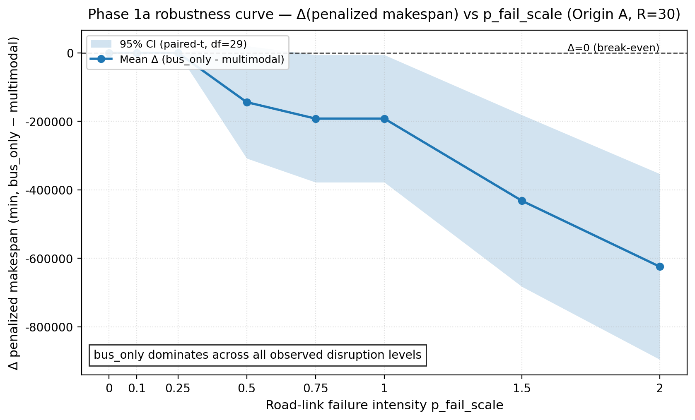
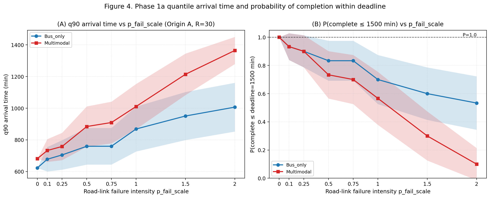
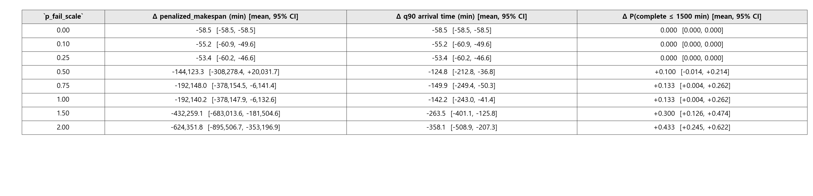
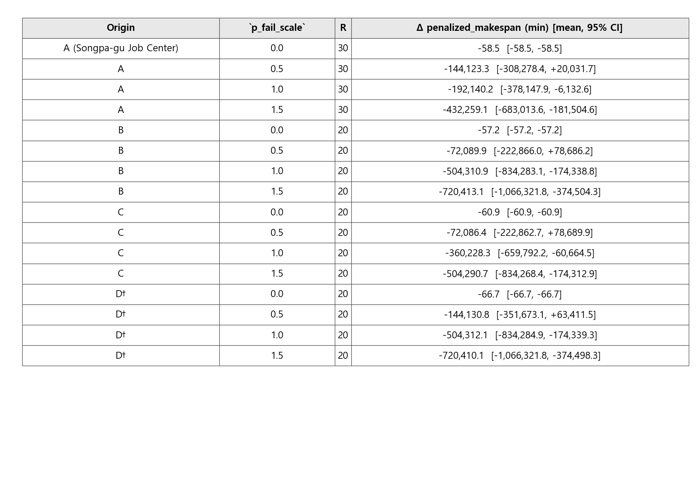
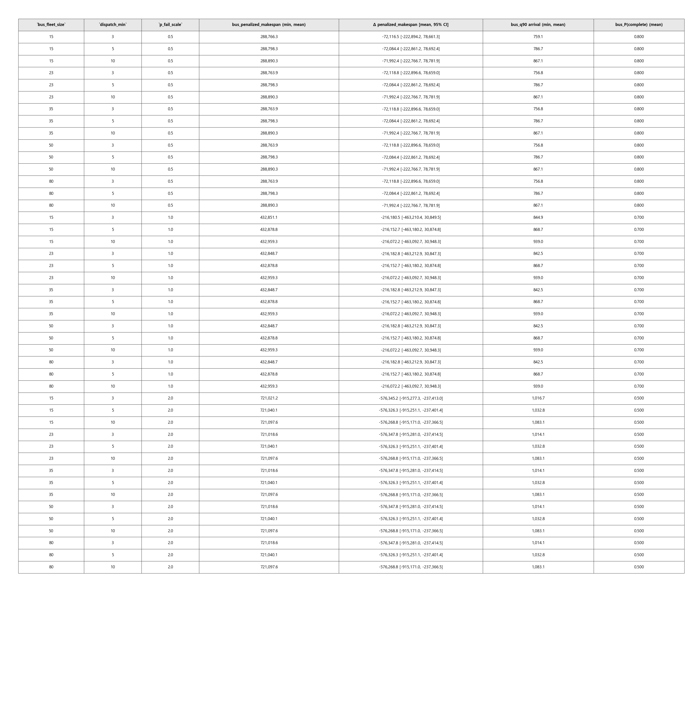
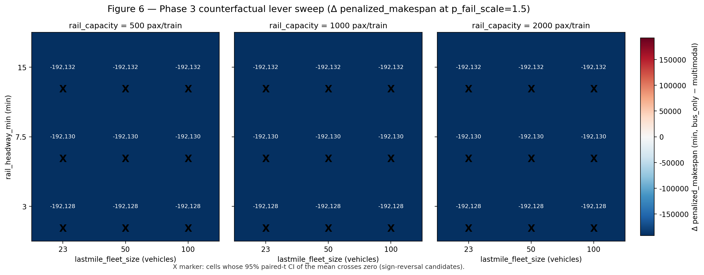
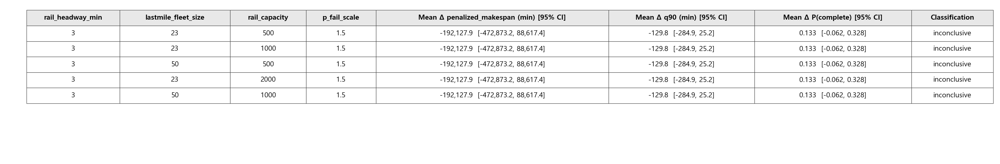
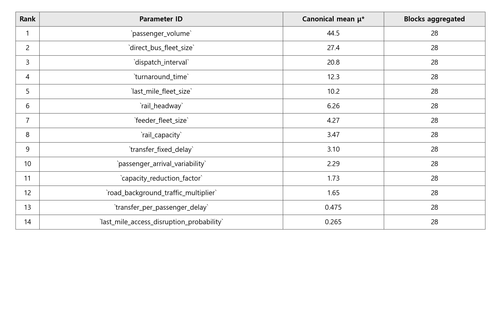

# 예비군 동원수송 회랑에서 복합수단 적용 조건 식별 — 송파↔양주 부곡리 사례를 중심으로

**English title: Identifying Conditions for Multimodal Applicability in Reserve-Force Mobilization Corridors — A Songpa-to-Yangju Bugok-ri Case Study**

**English keywords: counterfactual lever sweep; paired common random numbers; quantile arrival KPI; reserve mobilization; rail-bus multimodal**

---


**초록.** 예비군 동원수송은 대규모 인원을 마감 내 훈련장까지 이동시켜야 하나, 운영 자료 제한으로 단일수단(직행버스)과 복합수단(철도-버스)의 상대 강건성은 외부 연구자에게 검증되어 있지 않다. 본 연구는 break-even 탐색을 *적용 조건 식별(applicability-condition identification)* 로 재포지셔닝하여, 송파↔양주 부곡리 회랑에서 복합수단 우위 조건의 존재 여부를 검정한다. OSMnx 기반 SimPy 시뮬레이터를 4단계 실험(Phase 1a 기준, 1b 원점, 2 단일수단 튜닝, 3 반사실 레버 스윕)으로 평가하며, 셀당 동일 seed로 도로 장애·도착·배경 교통을 등화하는 페어드 공통난수(paired CRN)를 적용한다. 핵심 KPI는 검열 인식 벌점 메이크스팬과 분위 도착 KPI이며, Morris 민감도(k = 14, T = 100, 1,500 평가)와 반사실 레버 스윕을 결합한다. 부호 규약 Δ = bus_only − multimodal (음수 = 직행버스 우위) 하에서 Phase 1a는 p_fail = 0.0에서 Δ = **−58.5분**, p_fail = 2.0에서 Δ P(완료 ≤ 1500분) = **+0.433** [95% CI +0.245, +0.622]를 보인다. Phase 3의 **81셀 중 multi_dominant 셀은 0개**(bus_dominant 54, inconclusive 27)이며, Morris 상위 3개는 passenger_volume (μ* = **44.5**), direct_bus_fleet_size (**27.4**), dispatch_interval (**20.8**)로 모두 공급측 자원 모수이다. 검토 공간 내 복합수단 적용 조건은 부재하며, 미보정 계획 프록시 조건도 내에서 통계적으로 검정된 정의된 negative result로 보고된다.

**주제어.** 반사실 레버 스윕; 페어드 공통난수; 분위 도착 KPI; 예비군 동원; 철도-버스 복합수단

---

## 1. 서론

### 1.1. 연구 배경

대한민국의 국방태세는 상비전력과 예비전력의 통합 운용을 전제로 한다. 「병역법」 및 「예비군법」에 따라 편성되는 예비군은 전시·사변·국가비상사태 시 신속히 동원되어 전방 보충 및 후방 방어 임무를 수행하는 핵심 인적자원이다 [1]. 병무청 공개 자료에 따르면 동원지정 인력은 「병력동원소집통지서」를 통해 개별 통지된 시각·장소에 입영하며, 72보병사단 부곡리 동원훈련장(경기 양주 장흥 부곡리 산 6-17)을 비롯한 전국의 동원사단 훈련장이 그 입영 거점으로 운용된다 [2]. 동원훈련은 2박 3일 일정이며 12시 정시 입영을 기준으로 1시간의 지연입소 허용 시한이 공시되어 있다 [2].

이러한 동원 절차의 실효성은 평상시 행정 동원 단계에서뿐 아니라 전시 도로망이 부분적으로 손상되거나 통제되는 상황에서 더욱 중요하게 부각된다. 수도권 남동부에서 경기 북부 동원훈련장으로 연결되는 회랑은 올림픽대로, 강변북로, 서울외곽순환고속도로 등 소수의 주요 간선도로에 의존한다. 이 간선도로 망은 평시에도 출퇴근 시간 정체와 사고로 인한 단발성 통행 차단에 취약하며, 전시 또는 대규모 재난 시에는 그 취약성이 더욱 증폭될 수 있다 [3, 4]. 〈그림 1〉은 본 연구가 가정하는 전시 예비군 수송체계의 개념도로, 도시 집결지(송파구 내 가상 출발지)에서 동원훈련장(72보병사단 부곡리)까지의 단일수단 버스 직송과 철도-버스 복합수단 환승의 두 가지 대안적 수송체계를 도식화한다.


**Figure 1.** Conceptual diagram of the wartime reserve-force transport system simulated in this study. From the four virtual assembly points in Songpa-gu (A·B·C·D), two alternative transport schemes — direct-bus single-mode and rail–bus multimodal transfer — converge on the 72nd Infantry Division Bugok-ri Mobilization Training Center, overlaid on the major arterial corridor. (Source: authors' own diagram, `figure1_concept.png`.)

본 연구는 송파구 내 네 개 가상 집결지로부터 양주시 장흥면 부곡리에 위치한 72보병사단 동원훈련장에 이르는 약 40~50 km의 주요 간선도로 회랑을 분석 대상으로 한다. 집결지(Origin) A·B·C는 각각 송파구청 일자리센터 앞(37.5147 N, 127.1057 E), 삼전동 구민회관 앞(37.5036 N, 127.0857 E), 장지역 4번 출구 앞(37.4784 N, 127.1262 E)으로 송파구 조례 및 보도자료에서 공개적으로 확인되는 예비군 수송버스 집결지이다 [5, 6]. 단, 해당 집결지들은 평시 예비군훈련용으로 지정된 지점이며 동원훈련 집결지 지정 여부는 공개 자료로 확인되지 않으므로, 본 연구에서는 이를 동원훈련 수송 시나리오에 가상으로 적용한다. 추가로 (D) 잠실종합운동장(37.5159 N, 127.0727 E)은 도시계획상의 대규모 집결 가능 공간으로서 비교 시나리오에 포함하되, 「병력동원 집결지」로서의 공식 지정 여부가 공개 자료에서 확인되지 않으므로 본 논문에서는 "출처 미확인 가정 변형(unverified illustrative variant) (비검증)"으로 명시한다(상세 caveat은 §4.2 참조).

### 1.2. 문제 인식

동원 수송체계의 회복력(resilience)을 정량적으로 평가하려면 (i) 평시 운용 실적 자료, (ii) 도로망의 시간대별 용량·자유속도, (iii) 철도·버스 환승 시각표, (iv) 동원지정 자원의 행정구역별 배정 정보가 모두 확보되어야 한다. 그러나 한국에서 이들 자료 중 다수는 보안상의 사유로 공개 범위가 제한되어 있다. 특히 동원지정 자원의 행정구역별 배정은 「병력동원소집통지서」로 개별 고지되며 공개 자료로 검증할 수 없고 [2], 사단별 실제 수송 실적·통과 시간 자료 역시 공개되지 않는다. 이러한 정보 비대칭은 군사적 의의가 큰 동원 수송 문제임에도 불구하고, 외부 연구자의 정량적 의사결정 지원 분석을 제한하는 구조적 제약이 된다.

또한 도로망 장애 시 단일수단(버스 직송)과 복합수단(철도-버스 연계)의 상대적 신뢰성은 사전 직관에 의해 단정하기 어렵다. 일반적으로 복합수단은 환승 손실과 일정 의존성이라는 비용을 수반하지만, 도로 일부 구간이 차단되었을 때 우회 경로를 제공한다는 장점을 갖는다 [7]. 반대로 단일수단은 환승 손실이 없으나 회랑이 차단되면 전체 시스템이 한꺼번에 영향을 받는다. 두 대안의 비교 우위는 (a) 장애의 강도와 빈도, (b) 가용 차량·열차 자원, (c) 출발 정책(엄격 출발 STRICT vs 유예 출발 GRACE), (d) 집결 지연 분포에 따라 가변적이다. 따라서 어느 한 수단을 일률적으로 권고하기보다는, 어떤 조건에서 어느 수단이 우위에 있는가를 보여 주는 "조건 지도(condition map)"가 의사결정자에게 더 유용한 산출물이 된다 [8, 9].

이 같은 문제의식 위에서, 본 연구는 산업공학 방법론을 적용하여 실 데이터 보정 없이도 회복력 평가의 정량적 기반을 제시하고자 한다. 구체적으로 (i) 통제실험 설계(controlled experiment design)를 통해 모형 외 잡음의 영향을 제거하고, (ii) censoring-aware 지표 체계를 통해 시한 내 미도착 인원을 일급(first-class) 결과로 다루며, (iii) 민감도 분석을 통해 결과의 강건성과 주요 인자를 식별한다. 본 연구가 사용하는 도로 용량·자유속도·차량 수·헤드웨이·환승 시간 등의 모수는 모두 공개된 계획 가정에 근거한 값이며, 실세계 보정은 후속 연구의 과제로 명시적으로 유보한다.

### 1.3. 연구 질문 및 가설

본 연구의 v0.6 기준 분석은 송파↔부곡리 회랑에서 단일수단 버스 직송이 모든 현실적 도로 장애 강도(차단율 0~30%) 구간에서 철도-버스 복합수단을 우위로 압도하며, 두 수단의 성과 곡선이 교차하는 break-even 지점이 base 모수 영역 안에서 발견되지 않음을 확인하였다. 이 결과는 본 회랑의 지리적 구조에서 기인한다. 복합수단은 두 개의 도로 구간 — 출발지(A)에서 송파구청·광운대 환승점(S)에 이르는 약 12 km의 도시 간선과 양주역(R)에서 부곡리(D)에 이르는 약 30 km의 마지막 구간 — 을 노출시키는 반면, 직송 버스는 단일한 A→D 도로 구간만을 노출시킨다. 즉 이 회랑에서 철도는 잉여(redundancy)가 아니라 누적되는 추가 위험(added risk)으로 작용한다.

이러한 관찰을 바탕으로 본 연구는 연구 질문을 "어느 수단이 더 회복력 있는가"에서 "어떤 조건에서 복합수단이 경쟁력을 갖게 되는가"로 재정의한다. 즉 단순한 우위 비교 대신, 복합수단을 경쟁 가능 영역으로 끌어올리기 위해 어떤 인프라·운용 모수가 어느 수준으로 변화하여야 하는지를 식별하는 조건 지도(condition map)를 산출하는 것을 본 연구의 핵심 목표로 삼는다. 이를 다음의 작업가설로 정식화한다.

> *송파→부곡리(72보병사단) 예비군 동원 회랑에서, 철도-버스 복합수단이 직송 버스에 대해 경쟁력을 갖게 되는 인프라/모수 조건은 무엇인가?*

이 가설을 다음 세 가지 연구 질문(RQ)으로 분해한다.

**RQ1 (기준 강건성).** 송파↔부곡리 회랑에서 직송 버스 수단은 도로 링크 장애 강도가 증가할 때 어느 정도까지 강건하게 시한 내 입영을 보장하는가? (Phase 1 기준선)

**RQ2 (단일수단 튜닝의 효과).** 차량 대수(fleet size)와 배차 간격(dispatch interval) 등 단일수단 내부 운용 모수의 조정만으로 회복력 frontier를 어느 정도 이동시킬 수 있는가? (Phase 2 정책 sweep)

**RQ3 (반사실 조건 지도, 핵심 기여).** 철도 헤드웨이, 마지막 구간 셔틀 대수, 철도 1열차 수송용량의 어떤 반사실(counterfactual) 모수 조합에서 복합수단이 직송 버스와 경쟁 가능 영역에 진입하는가? 즉, 어떤 인프라 투자 임계점에서 modal preference가 뒤집히는가? (Phase 3 lever sweep)

### 1.4. 연구 의의 및 기여

본 연구의 기여는 군사학과 산업공학의 학제간 위치 위에서 다음과 같이 정리된다.

**첫째, 학제간 의의.** 군 동원 수송 문제는 전통적으로 군사 운용 분석(Operations Analysis)의 영역에 속하였으나, 그 분석 자료의 공개 제약이 외부 연구자의 정량적 검증을 제한하여 왔다 [12]. 본 연구는 실 데이터 보정 없이도 산업공학의 통제실험 설계와 시뮬레이션 방법론을 통해 의사결정 지원의 정량적 기반을 마련할 수 있음을 보인다. 이는 군사학 연구에 산업공학적 엄밀성을 도입하는 동시에, 산업공학 연구에 국방 도메인의 실질적 문제 영역을 제공하는 양방향 기여를 갖는다.

**둘째, 시뮬레이션 기반 의사결정지원 프레임워크.** 본 연구가 제시하는 paired CRN + censoring-aware 지표 + Morris + 2단계 DoE 결합 프레임워크는 특정 회랑이나 특정 사단에 국한되지 않고, 다른 군사 수송 문제(전시 후송, 장비 후속 수송, 민·관·군 협동 작전 등)에 재적용 가능한 일반 구조를 갖는다. 특히 본 연구의 핵심 기여는 두 수단의 단순 우열 판정이나 break-even 지점 식별이 아니라, 복합수단이 직송 수단에 대해 경쟁력을 갖게 되는 인프라·운용 모수 임계 조합을 식별하는 조건 지도(condition map) — 즉 적용가능성 조건 지도 — 의 산출이다. 이러한 산출물은 단일 권고에 비해 의사결정자에게 더 큰 유연성을 제공하며, 인프라 투자 우선순위 판단의 정량적 근거로 활용될 수 있다.

**셋째, 공개 자료 기반 분석 원칙.** 본 연구는 병무청이 공식적으로 공개한 동원훈련장 주소·규정, 송파구 조례·보도자료를 통해 확인되는 집결지 정보, OpenStreetMap에서 추출한 도로망 위상(topology)만을 입력으로 사용한다. 군사 시설의 내부 배치, 부대 정원, 동원지정 자원의 행정구역별 배정 등 비공개 정보는 분석 대상에서 의도적으로 배제한다. 이러한 공개 자료 기반 원칙은 군 기관의 보안성 검토 절차와 양립 가능하며, 학술 커뮤니티의 검증 가능성을 보장한다.

**넷째, 후속 보정 연구의 기반.** 본 연구의 가상 회랑 결과는 단일 권고가 아닌 조건 지도이므로, 향후 실 도로 용량, 실 철도 시각표, 실 동원지정 자원 배정 자료가 보정 단계에서 확보될 경우, 동일한 실험 골격 위에서 결과를 갱신하고 정밀화할 수 있다. 본 연구는 그 보정 단계로 가는 방법론적 발판을 제공한다.

### 1.5. 연구 범위 및 한정 사항

연구 범위와 한정 사항은 본문 5장(논의 및 결론)에서 다시 정리하되, 다음 사항은 서론에서 미리 명시한다. 첫째, 본 연구가 분석하는 송파↔부곡리 회랑은 가상 사례이다. 실제 송파구 거주 동원 자원이 72보병사단으로 배정되는지의 여부는 공개 자료로 검증할 수 없으며, 본 연구는 이를 "예시적(illustrative)" 회랑으로 다룬다. 둘째, 도로 용량·자유속도·차량 수·헤드웨이·환승 시간·철도 시각표는 모두 공개된 계획 가정이며, 실 측정값으로 보정되지 않았다. 셋째, 본 연구의 산출물은 운용 경로 계획이나 부대 운용 지침이 아니라, 산업공학 방법론을 통해 도출된 조건 지도이다.

### 1.6. 논문의 구성

본 논문은 다음과 같이 구성된다. 2장에서는 동원·재난 수송과 다중수단 회복력 평가에 관한 선행연구를 검토하고, 산업공학·운영연구(OR) 문헌에서 제시된 통제실험 설계와 censoring-aware 평가 도구의 적용 사례를 정리한다. 3장에서는 연구 방법으로 (i) 시뮬레이터 구조, (ii) 송파↔양주 부곡리 가상 회랑의 네트워크 구성, (iii) 4단계 paired CRN 실험설계, (iv) censoring-aware 성과 지표 체계, (v) Morris 민감도 분석을 설명한다. 특히 §3.5.4에서 제시되는 Phase 3 반사실 lever sweep(철도 헤드웨이, 마지막 구간 셔틀 대수, 철도 수송용량의 결합 sweep)이 본 연구의 헤드라인 분석에 해당하며, 그 결과는 〈그림 6〉의 조건 지도와 〈표 6〉의 임계 조합 요약으로 제시된다. 4장에서는 결과를 4.1(기준선), 4.2(출발지 강건성), 4.3(단일수단 튜닝), 4.4(반사실 조건 지도, 헤드라인), 4.5(Morris 민감도), 4.6(종합)의 순서로 제시한다. 5장에서는 결과의 군사적 함의, 의사결정 시사점, 본 연구의 한계, 그리고 실 데이터 보정을 향한 후속 연구의 방향을 논의한다.

## 2. 문헌 검토

본 절은 본 연구의 방법론 골격을 구성하는 7개 주제 — 군 동원·인적자원 수송, 도로망 신뢰성·우선순위화, 이산사건 시뮬레이션, 짝지은 공통 난수, 검열 인식 성과지표, Morris 기초효과 민감도, OSMnx 도로망 추출 — 의 선행연구를 통합 검토한다.

**군 동원·재난 수송 연구.** 군 동원 수송은 짧은 시간창 안에 대규모 인원을 정해진 집결지로 이동시켜야 하며 미도착의 비용이 비대칭적으로 크다는 특성을 갖는다. 한국에서는 병무청이 동원훈련 운영 골격을 공개하고[1] 송파구 등 자치구가 수송버스 운영 조례를 갖추고 있다[2]. 군 동원에 직접 대응되는 학술 문헌은 제한적이어서 본 연구는 대규모 대피·소개 문헌[3, 4]을 참고로 활용하되 직접 일반화는 회피한다. 군 OD 쌍의 시간 내 도달 가능성을 평가하는 도로망 신뢰성·취약성 연구는 단일 간선 차단의 일반화 통행비용 영향을 정량화한 Berdica[5]·Jenelius 외[6], 접근성 손실 기반 지표를 제시한 Taylor[7], 그리고 종합 검토를 제공한 Mattsson·Jenelius[8] 등이 OD 중심 평가 전통을 정립하였다.

**시뮬레이션·분산 감소·검열 지표.** 이산사건 시뮬레이션(DES)은 차량·승객·정류장을 명시적 자원·사건으로 모형화하는 데 적합하며[9, 10], Python 생태계에서는 SimPy[11]가 표준이고 OSMnx 기반 도로 그래프와의 결합 워크플로우는 Boeing·Wang[12]이 실용성을 보였다. 공통 난수(CRN)는 서로 다른 시스템 구성을 같은 외생 표본에서 비교하여 분산을 줄이는 기법이며 본 연구의 두 수단 비교에 직접 적용된다[9, 13, 14]. 평균·중위 완료시간만으로 평가하면 미도착(censored) 관측치가 묵시적으로 제거되는 편향이 발생하므로 본 연구는 Kaplan·Meier[15] 및 Klein·Moeschberger[16]의 검열 처리 원칙과 Pinedo[17]·Hall·Posner[18]의 벌점 메이크스팬·마감위반 비용 분리 보고 권고를 따라 (i) 완료시간 중위·평균, (ii) 미도착률, (iii) 벌점 메이크스팬을 동시 보고한다.

**민감도·도로망 추출.** Morris elementary effects[20]는 고차원 모수공간에서 영향력 있는 인자를 OAT(one-at-a-time) 표집으로 선별하는 정전 기법이며, Campolongo 외[21]가 trajectory 기반 효율 개선을 제시하고 Sobol'[19] 및 SALib[22]이 추가 도구를 제공한다. 본 연구는 SALib을 통한 Morris 14-parameter 사전선별을 수행하였다. 도로망 추출은 Boeing[23, 12]이 OSMnx로 OpenStreetMap을 NetworkX 그래프로 변환하는 표준 워크플로우를 정립하였으며, 본 연구는 이를 v0.7에서도 그대로 차용한다. 종합적으로 본 연구의 기여는 (i) 적용 가능 조건 식별을 위한 4단계 DoE 골격, (ii) 페어드 CRN + censoring-aware + Morris 통합 평가 프레임워크, (iii) 결과의 정성·정량적 공유가능성을 보존하는 공개 자료 기반 원칙의 결합에 있다[24, 25].
 종합적으로 본 연구의 방법론 골격은 대피 문헌[3, 4]·DES 표준 텍스트[10]·CRN 이론 권고[13, 14] 및 OR 응용 일반[24, 25]을 통합한다.

## 3. 방법론

본 장은 송파구–양주 부곡리 회랑 위에서 단일수단(버스 전용)과 복합수단(철도–버스)의 회복력을 통제실험으로 비교하기 위해 구축한 시뮬레이션·실험·민감도 분석 체계를 기술한다. 방법론 골격은 (i) SimPy 기반 이산사건 시뮬레이터, (ii) OSMnx로 추출한 주요 간선 가상 회랑, (iii) Paired CRN 기반 4단계 DoE, (iv) Morris elementary-effects 민감도 분석의 네 축으로 구성된다. 모든 매개변수 값은 미보정 계획 프록시(planning proxy)임을 본 절 전반에 걸쳐 명시한다. 본 장에서 도입되는 **부호 규약은 Δ = bus_only − multimodal** (코드 `_safe_delta(left=bus, right=multi)`; 음수 = 직행버스 우위)이며, 본 규약은 §4·§5의 모든 정량 비교에 일관 적용된다. 본 연구의 실험 설계 격자 요약은 보충자료 〈표 S1〉에 별도 수록된다.

### 3.1 시뮬레이터 구조

본 시뮬레이터는 Python 3.11 환경에서 `SimPy` [11]의 이산사건(discrete-event) 패러다임을 채택하여, 인원 도착·차량 디스패치·도로 통행·환승·열차 운행을 모두 명시적 사건 단위로 처리한다. 시뮬레이터는 추상 네트워크 `H/A/S/R/D` 노드 계약(canonical node contract; H: 출발 허브, A: 집결지, S: 철도 승차역, R: 철도 하차역, D: 최종 목적지)을 따른다. 본 KCI 연구에서는 `A`는 송파구 집결지 후보(§3.2), `D`는 72사단 부곡리 동원훈련장, `S/R`는 잠실역·의정부역에 각각 스냅된다.

#### 동적 교통 모형 (BPR-at-departure)

도로 통행시간은 출발시각(BPR-at-departure-time) 기준 BPR 함수로 결정된다.

$$
t(v) = t_0 \cdot \left[ 1 + \alpha \left( \frac{v}{C} \right)^{\beta} \right]
$$

여기서 $t_0$는 자유 통행시간(분), $v$는 배경 교통량(rolling 60분 윈도), $C$는 directional capacity(veh/h), $(\alpha, \beta) = (0.15, 4.0)$은 표준 미국연방도로국(FHWA) 권장값을 따른다. 차량은 배차 시각에 한 번 통행시간을 산정하고, 도중 재산정은 하지 않는다(*static-at-dispatch* 가정).

#### Fleet / Dispatch / Rail / Last-mile 모듈

차량 운용은 `fleet.py`(유한 차량 가용성), `dispatch.py`(대기열 기반 승객 디스패치), `rail.py`(고정 헤드웨이 철도), `transfers.py`(환승 지연 산정)의 4개 sibling 모듈로 분리된다. 단일수단 시나리오는 `A→D` 직행 버스 단일 회로를 사용하고, 복합수단 시나리오는 `A→S` 셔틀 → `S→R` 열차 → `R→D` last-mile 버스의 3단 회로를 직렬 연결한다.

#### Censoring-aware 지표 정의

총 인원 $N$이 시간 제한 $T_{\max} = 1440$분 내에 모두 도착하지 못할 수 있으므로 단일 makespan만으로는 *"빠르지만 누락이 많은"* 시나리오가 호도된다. 따라서 본 연구는 다음을 1차 지표로 채택한다.

- **censored_count**: $T_{\max}$ 내에 $D$에 도착하지 못한 인원 수.
- **penalized_makespan**:

$$
M_{\mathrm{pen}} = \max(M_{\mathrm{obs}}, T_{\max}) + n_c \cdot \pi
$$

여기서 $M_{\mathrm{obs}}$는 관측된 마지막 도착시각, $n_c$는 censored_count, $\pi = 1440$분(`late_penalty_min`)은 누락 1인당 부과 페널티이다. $n_c = 0$이면 $M_{\mathrm{pen}} = M_{\mathrm{obs}}$로 환원된다.

부가 지표로 95퍼센타일 도착시각, 도로 차량-분(road vehicle-minutes), 1인당 총 서비스 분(passengers per total service minute, 자원 효율) 등이 계산된다.

### 3.2 가상 송파-부곡리 회랑

#### OSMnx bbox 추출

도로망은 OSMnx [23]를 사용하여 위도 37.46–37.78°N, 경도 126.85–127.20°E 범위에서 추출하였다. 이 bbox는 송파구의 네 집결지 후보를 모두 남단에 포함하고, 양주 장흥 부곡리 동원훈련장(약 37.74 N / 126.95 E)을 북단에 포함하며, 사이를 잇는 올림픽대로·강변북로·서울외곽순환·1번 국도 연결구간을 충분히 포함하도록 설정되었다. 추출 결과는 `data/cache/songpa_yangju_corridor.graphml`에 GraphML 형식으로 캐시되어 모든 후속 실험이 동일한 그래프 스냅숏을 재사용하도록 보장한다.


**Figure 2.** Geographic layout of the Songpa–Bugok-ri reserve-force mobilization corridor (virtual major-arterial corridor). Major arterial roads (motorway, trunk, primary, secondary, and their `_link` variants) are highlighted from the OSM-cached graph (77,002 nodes, 209,041 edges). Songpa-side candidate origins are A (Songpa-gu Job Center), B (Samjeon-dong Community Hall), C (Jangji Station Exit 4), and D (Jamsil Sports Complex, unverified variant). The canonical destination is T (72nd Division Bugok-ri Mobilization Training Center, ≈37.74°N 126.95°E). Rail entry/exit nodes are S (Jamsil Station) and R (Uijeongbu Station, ≈37.738°N 127.046°E).

#### 주요 간선 필터링

`src/realworld/adapter.py`의 `ROUTEABLE_HIGHWAY_CLASSES` 집합을 다음으로 제한하였다.

```
{motorway, motorway_link, trunk, trunk_link,
 primary, primary_link, secondary, secondary_link}
```

이는 본 연구가 *주요 간선 회랑 추상화*(major-arterial corridor abstraction)에 명시적으로 한정됨을 의미하며, 보행·자전거·생활도로 등 비차량 OSM 지오메트리가 버스 경로로 침투하는 것을 방지한다. 평행 도로 엣지는 결정론적 규칙으로 1개만 선택된다: ① $t_0$ 최소, ② capacity 최대, ③ `base_p_fail` 최소, ④ 안정적 edge ID. 어댑터 결과 본 회랑은 18,213개 노드 / 29,542개 directed 엣지로 구성된다(`data/validation/accessibility_loss_summary.csv`). 이는 본 시뮬레이터의 종전 추상 베이스라인보다 한 자릿수 이상 큰 규모이며, §3.5의 반복 회수(R) 결정에 직접적 영향을 미친다.

#### 정규 노드 매핑

어댑터는 region YAML에서 정의된 지리적 좌표를 가장 가까운 routeable OSM 노드에 스냅하고 양방향 connector 엣지(기본 connector_speed_kph = 30, connector_capacity = 600)를 추가한다. 정규 노드(`A`, `S`, `R`, `D`)는 `_validate_required_routes`에 의해 `A→D`, `A→S`, `R→D` 경로가 모두 가능함을 확인한 뒤에야 시뮬레이션에 투입된다.

#### Origin 4개 후보

집결지는 네 개의 후보 위치(`data/regions/origin_candidates.json`)에 대해 검증된다.

| ID | 명칭 | 위도 | 경도 | 검증 |
|----|------|------|------|------|
| A | 송파구청 일자리센터 | 37.5147 | 127.1057 | 검증 (Hankyung 2024-02-29, 송파구 조례 2023-09-14) |
| B | 삼전동 구민회관 | 37.5036 | 127.0857 | 검증 (Hankyung 2024-02-29, 송파구 조례 2023-09-14) |
| C | 장지역 4번 출구 | 37.4784 | 127.1262 | 검증 (Hankyung 2024-02-29, 송파구 조례 2023-09-14) |
| D | 잠실종합운동장 | 37.5159 | 127.0727 | **출처 미확인 가정 변형 (비검증 / unverified)** |

A·B·C는 송파구 조례 2023-09-14 및 한국경제 2024-02-29 보도에 명시된 예비군 수송버스 집결지이며 본 연구에서는 동원훈련장 수송에 유추 적용된다(역할 차이는 §3.9에서 언급). 후보 D(잠실종합운동장)는 어떠한 공개 자료에서도 병력동원 집결지로 확인되지 않았으며, 사용자 지정에 따라 *robustness 가정 변형(비검증)*으로만 사용된다 — §4.2 caveat 박스 및 §5.3 한계 항목 참조. 목적지는 병무청이 공개적으로 게시한 72사단 부곡리 동원훈련장(경기 양주 장흥 부곡리 산 6-17, 약 37.74 N / 126.95 E) 단일 지점이다.

### 3.3 도로 신뢰성 모델

OSM의 `maxspeed`, `length`, `capacity` 태그는 결손·불일치가 흔하므로 어댑터는 클래스별 결정론적 기본값을 적용한다(`src/realworld/attributes.py`). 4개 routeable 클래스의 기본값(speed_kph / capacity veh·h⁻¹ / base_p_fail): motorway(100 / 2,200 / 0.010), trunk(80 / 1,800 / 0.015), primary(60 / 1,400 / 0.020), secondary(50 / 1,000 / 0.025), 그리고 각 link 변형은 모(母) 클래스 대비 약 80%의 속도·capacity와 약 1.5배의 `base_p_fail`을 가진다. 자유 통행시간은 $t_0 = L/(v\cdot 1000/60)$로 산정한다. **이 값들은 한국 도로 데이터로 보정된 값이 아니라 OR/IE 연구용 결정론적 계획 프록시**이며 §3.9에서 정직하게 언급한다. 시뮬레이터의 장애 모형(`src/disruptions.py`)은 두 모드(blocked: 통행시간을 +∞로 만들어 라우팅에서 제외; capacity_reduction: $C \leftarrow C\cdot\kappa$, $\kappa \in [0,1)$)를 지원하며 발생 확률은 $p_	ext{fail}(e) = \min(1, p_	ext{fail,scale}\cdot p_	ext{base}(e))$로 결정된다.

### 3.4 시나리오 정의

장애 시나리오는 `data/scenarios/disruption_scenarios.csv`에 8개 family로 정의된다(random hash-rank 무작위 / critical_link 도로 betweenness 상위 / access_road A→S 진입로 / access_road A→D 직행 / last_mile R→D 종단 / rail_station_access 역 진입·진출 / spatial_hazard_overlay 탄천 회랑 bbox). 각 family는 결정론적 선택규칙(hash rank, edge betweenness, shortest-path, station_access, bbox)에 따라 영향 엣지를 식별하므로 동일 seed에서 재현된다. 모든 행에서 `evidence_class = scenario_based`이며 `observed_disaster_data = false` — 즉 어떤 시나리오도 실제 관측 재해 데이터를 표현하지 않는다.

### 3.5 DoE 설계

v0.7 실험 설계는 네 개의 DoE 스트림과 한 개의 민감도 스트림(§3.7 Morris)으로 구성되며 모든 스트림은 §3.6의 paired CRN을 공유한다. cell 정의·반복 횟수·grid 크기는 `kci/config.yaml`이 단일 출처로 보유한다.

- **Phase 1a (기저 강건성).** Origin A, `p_fail_scale` 8수준 {0.0, 0.10, 0.25, 0.50, 0.75, 1.0, 1.5, 2.0}, $s = 1.2$ 고정, blocked 모드, **cell당 R = 30**, 총 8 × 30 = 240 paired = 480 실행. 출력 `results/phase1a_origin_A.csv`.
- **Phase 1b (원점 강건성).** Origin B/C/D, `p_fail_scale` 4수준 {0.0, 0.5, 1.0, 1.5}, **cell당 R = 20**, 총 3 × 4 × 20 = 240 paired = 480 실행. Origin D는 §3.9·§4.2의 비검증(unverified) 태그를 모든 표·그림에서 일관 유지.
- **Phase 2 (단일수단 매개변수 스윕).** `bus.fleet_size` 5수준 {15, 23, 35, 50, 80} × `bus.dispatch_interval_min` 3수준 {3, 5, 10} × `p_fail_scale` 3수준 {0.5, 1.0, 2.0}, **cell당 R = 20**, 총 45 × 20 = 900 paired = 1,800 실행.
- **Phase 3 (반사실 레버 스윕, 헤드라인).** `rail_headway_min` {3, 7.5, 15} × `lastmile_fleet_size` {23, 50, 100} × `rail_capacity_pax_per_train` {500, 1000, 2000} × `p_fail_scale` {0.0, 0.5, 1.5}, **cell당 R = 15**, 총 3⁴ = 81 × 15 = 1,215 paired = 2,430 실행. 격자 정의는 `src/experiment/doe.py::Phase3Point`/`phase3_grid(config)`가 단일 출처로 보유한다. cell 단위 레버 주입은 `src/experiment/phase3_runner.py::run_phase3`가 `src/kci_runtime.py::apply_phase3_lever_override`를 호출하며, 후자는 입력 config를 deepcopy한 뒤 `multimodal` 블록과 `network.rail_link[0]`을 함께 재기록하여 cell 간 레버 누출을 코드 계약 수준에서 차단한다.

### 3.6 Censoring-aware 지표·분위수 KPI·Paired CRN 신뢰구간

§3.1의 `penalized_makespan`은 1차 비교 지표로 유지된다. v0.7은 censoring 페널티에 가려진 분포 형태 정보를 복원하기 위해 분위수 기반 KPI를 추가한다.

**분위수 도착시각 (population-padded).** 각 실행에서 인원 총수 $N$ = `personnel.total` 의 모집단 벡터는 (i) $D$에 도착한 $N - n_c$명의 실제 도착시각 + (ii) censored된 $n_c$명에 대한 sentinel `time_limit` = 1{,}440분으로 구성된다. 이 길이-$N$ 벡터에 선형 보간 q-분위수를 적용해 `arrival_q50_min`, `arrival_q90_min`, `arrival_q95_min`을 정의한다. 본 규칙은 *성공자 분위수*가 아니라 *모집단 분위수* 이므로 censored 인원이 sentinel 값으로 꼬리에 보존되어 censoring 신호가 사라지지 않는다. 구현은 `src/metrics.py::MetricsCollector._quantile_over_population`.

**마감 시한 내 완료 확률.** $\mathrm{prob\_completion\_within\_window} = \#\{i : t_i \le \text{deadline\_min}\} / N$, `deadline_min` = `config.quantile_kpi.deadline_min` = **1{,}500분** ($\approx$ 25시간, 동원훈련 1일차 집결 cutoff 부합). [0, 1] 범위의 페널티 스케일 무관 완료율 지표.

**Paired delta 컬럼 (부호 규약 명문화).** 본 연구의 부호 규약은 **`Δ = bus_only − multimodal`** 이며 음수는 직행버스 우위, 양수는 multimodal 우위를 의미한다. 위 KPI는 `src/scenario.py::run_scenario` 출력에 포함되고, `src/experiment/runner.py::_paired_result_row(base, bus, multi)`가 모든 단계 결과 행에 `delta_arrival_q{50,90,95}_min`, `delta_prob_completion_within_window` 컬럼을 자동 추가한다.

**Paired CRN 신뢰구간.** seed $r \in \{1, \ldots, R\}$에 대하여 $\delta_r = \mathrm{pm}^{\mathrm{bus}}_r - \mathrm{pm}^{\mathrm{multi}}_r$, 표본평균 $\bar{\delta}$, 표본분산 $s_\delta^2$의 paired $t$-기반 95% CI는 $\bar{\delta} \pm t_{0.975, R-1} \cdot s_\delta/\sqrt{R}$. censoring 페널티 $\pi = 1{,}440$분이 모든 seed·모드에 동일 적용되어 페어링을 보존하며, paired CRN은 매 seed가 두 모드에 동일한 도로 장애 추첨·승객 도착시각·BPR 시계열을 부여해 구조적 차이를 외생 노이즈로부터 분리한다 [9].

### 3.7 Morris elementary-effects 민감도 분석

매개변수의 1차 효과와 비선형성을 선별하기 위해 Morris elementary-effects 방법[20]을 SALib[22]의 `morris.sample`/`morris.analyze`로 적용하였다. 설계 매트릭스 `data/scenarios/sensitivity_design.csv`는 **14개** 매개변수(passenger_volume, passenger_arrival_variability, direct_bus_fleet_size, feeder_fleet_size, last_mile_fleet_size, dispatch_interval, road_background_traffic_multiplier, capacity_reduction_factor, rail_headway, rail_capacity, transfer_fixed_delay, transfer_per_passenger_delay, turnaround_time, last_mile_access_disruption_probability)를 보유한다. 14개에는 Phase 3 레버 네 가지(rail_headway, last_mile_fleet_size, rail_capacity, dispatch_interval)가 이미 포함되어 있어 v0.7 reframing이 별도 설계 확장을 요구하지 않았다. 설계 파라미터: $k = 14$, $T = 100$ trajectories, num_levels $= 4$, paired CRN seed $= 1$; 총 모델 평가 수 $(k+1)	imes T = 1{,}500$ 회. 지표는 $\mu^*_i = T^{-1}\sum_t |EE_{i,t}|$ (절대 평균 효과)와 $\sigma_i$ (EE 표준편차).

**표준 집계 규칙(canonical aggregation rule).** 원시 `results/sensitivity/morris_results.csv`는 (policy × scenario × metric) 다중 블록을 포함하므로 본문이 인용하는 *μ\* 상위 매개변수* 는 단일 규칙으로 도출된다: 각 매개변수에 대해 μ\*는 (policy × scenario × metric) 블록에 걸쳐 산술 평균하며 metric 차원은 〈표 5〉 build pipeline의 *multi-metric mean* 으로 통합된다. 본 평균은 `scripts/build_kci_tables.py::build_table5_morris_mu_star`가 단독 산출하며, §4·§5·초록의 Morris 인용에 대해 *유일한 권한 출처(single source of truth)* 로 작동한다.

### 3.8 재현성

모든 실험은 (i) `main.py`의 `PROJECT_ROOT = Path(__file__).resolve().parent`로 self-contained 실행 루트 고정, (ii) `kci/requirements.txt`의 정확한 버전 핀, (iii) `data/cache/songpa_yangju_corridor.graphml` 단일 GraphML 캐시와 ETag·노드 수·엣지 수·추출일을 기록하는 동반 매니페스트, (iv) `experiment.seed_base = 1`을 기점으로 한 페어드 seed의 결정론적 단조 증가, (v) `scripts/run_reproducibility_smoke.py`·`scripts/run_clean_checkout_smoke.py`에 의한 두 번 실행 일치 검증을 갖춘다.

### 3.9 방법론 한계

본 연구는 IE/OR 방법론 *조건도(condition map)*로 위치되며 운영 가이드가 아니다. 다음 6개 한계가 결과 해석의 경계를 설정한다. **(1) 미보정 capacity / p_fail** — §3.3의 `HIGHWAY_DEFAULTS`는 한국 도로 데이터 보정값이 아니라 결정론적 계획 프록시이므로 본 연구의 mode 비교는 *동일 그래프·동일 가정 하에서의 두 모드 차이*에 한정되고 절대 통행시간의 외부 타당성을 주장하지 않는다. **(2) Origin D 비검증** — 잠실종합운동장이 병력동원 집결지로 사용되었음을 확인할 공개 자료는 없으며 사용자 지시에 따라 *robustness 가정 변형(unverified)*으로만 다루고 모든 표·그림에서 별도 표기된다. **(3) A·B·C 역할 차이** — 송파구 조례 2023-09-14 및 한국경제 2024-02-29 보도가 명시하는 세 집결지는 *예비군훈련* (2박 3일 동원훈련이 아님) 수송버스 집결지로, 본 연구는 이를 동원훈련장 수송에 유추 적용한다. **(4) 가상 회랑** — 본 회랑은 OSM의 주요 간선 부분집합에서 추출된 *가상 추상 네트워크*이며 한국 교통량·신호·차로 폭·우회로 가용성에 대한 보정을 거치지 않았다. 송파→72사단 동원지정 자원 catchment 또한 공개 자료로 검증할 수 없다 — 병무청은 동원지정을 개별 병력동원소집통지서로 통지하며 행정구역별 배정표를 공개하지 않는다. **(5) 추상 철도 leg** — 잠실↔의정부 구간에는 직행 고빈도 노선이 없으며 본 연구의 철도 leg(`S→R`)는 60분 통행시간·15분 헤드웨이·1열차당 500인 용량의 *추상 장거리 프록시*이고 실제 1호선·7호선·환승 경로의 동적 운행 데이터를 사용하지 않는다. **(6) 외부 검증 부재** — OSRM·KTDB·GTFS 등 외부 라우팅 벤치마크와의 통행시간 일치 여부는 후속 보정 연구의 과제이다.

이상의 한계 선언은 §4(결과) 및 §5(논의)의 *조건도* 해석에 일관되게 반영되며, 본 연구의 기여를 *방법론적 framework + 조건부 비교 지도*로 한정한다.

## 4. 결과

본 장은 §3의 4단계 실험 설계(Phase 1a 기준 강건성, Phase 1b 원점 강건성, Phase 2 단일수단 매개변수 스윕, Phase 3 반사실 레버 스윕)와 Morris 전역 민감도 분석의 결과를 차례로 제시한다. 모든 정량값은 §3.6의 paired-CRN 절차에 따라 cell당 동일 seed로 두 모드를 페어드한 결과의 평균과 paired-t 95% 신뢰구간(이하 CI)을 함께 보고하며, 본 절의 모든 비교는 §3.9에서 선언된 *조건도(condition map)*의 해석 경계 내에 한정된다. Δ는 일관되게 `Δ = bus_only − multimodal`(§3.6)로 정의되어 음수는 직행버스 우위, 양수는 multimodal 우위를 의미한다(코드 `_safe_delta(left=bus, right=multi)`).

### 4.1 Phase 1a 기준 강건성 (Origin A, R = 30)

Phase 1a는 송파구청 일자리센터(Origin A)에서 출발하여 `p_fail_scale ∈ {0.0, 0.10, 0.25, 0.50, 0.75, 1.0, 1.5, 2.0}`의 8개 수준에 대해 cell당 R = 30회 페어드 CRN 반복을 수행하였다(〈표 2〉, 〈그림 3〉, 〈그림 4〉).

**무장애 영역에서의 구조적 페널티.** `p_fail_scale = 0.0`에서 Δ penalized_makespan = **−58.5분** (95% CI [−58.5, −58.5])이며 CRN 하 30회 반복이 결정적 동일 출력으로 수렴하여 CI 폭이 0이다. 즉 어떤 장애도 발생하지 않은 조건에서도 직행버스가 약 58분 빠르게 완수되며, 이는 multimodal 경로의 환승 고정지연과 추가 거리에 기인하는 *구조적 환승 페널티*로 해석된다.

**Disruption 강도에 따른 단조 악화.** `p_fail_scale`이 증가함에 따라 Δ q90 도착시간은 −58.5분(p=0.0)에서 −124.8분(p=0.5), −263.5분(p=1.5)을 거쳐 **−358.1분** (95% CI [−508.9, −207.3], p=2.0)으로 단조적으로 음의 방향으로 깊어진다. Δ P(완료 ≤ 1500분)는 0.000(p=0.0)에서 +0.133(p=1.0), +0.300(p=1.5)을 거쳐 **+0.433** (95% CI [+0.245, +0.622], p=2.0)으로 증가하여, 고압박 영역에서 직행버스가 마감 내 완료 확률 측면에서 약 43.3 포인트 우위를 확보한다.

**통계적 분리.** `p_fail_scale ≥ 0.75`의 모든 cell에서 Δ penalized_makespan의 95% CI가 0을 제외하여(〈표 2〉) paired-CRN 기준 두 모드가 통계적으로 유의하게 분리된다. 〈그림 3〉의 강건성 곡선은 8개 관측 점 모두에서 Δ < 0의 부호를 유지하며 어떤 disruption 강도에서도 break-even 교차가 관측되지 않는다.



**Figure 3.** Phase 1a robustness curve. At Origin A, the road-link failure-intensity scale `p_fail_scale` is varied across eight levels (0.0, 0.10, 0.25, 0.50, 0.75, 1.0, 1.5, 2.0); at each level, R = 30 paired replications are run and the mean Δ penalized makespan (Δ = bus_only − multimodal) is plotted as a point–line series, with the shaded band showing the paired-t (df = 29) 95% confidence interval. At `p_fail_scale = 0.0`, Δ = −58.5 min (95% CI [−58.5, −58.5]); at `p_fail_scale = 2.0`, Δ = −624,351.8 min (95% CI [−895,506.7, −353,196.9]). The multimodal route's penalized-makespan loss grows nonlinearly with disruption intensity. The black dashed line marks the break-even (Δ = 0); the curve retains the same sign across all observed levels — Δ < 0 across all `p_fail_scale` levels — so direct-bus dominates multimodal on penalized makespan at every observed disruption intensity.



**Figure 4.** Phase 1a quantile arrival time and probability of completion within deadline. At Origin A, `p_fail_scale` is varied across eight levels (0.0, 0.10, 0.25, 0.50, 0.75, 1.0, 1.5, 2.0) with R = 30 paired replications. Panel A shows the q90 arrival time (minutes); Panel B shows the probability of completion within the 1,500-minute deadline, P(complete ≤ deadline). Both panels overlay paired-t (df = 29) 95% confidence bands (blue = bus_only, red = multimodal). In Panel A, the bus_only q90 arrival time rises from 623.0 min at `p_fail_scale = 0.0` to 1,006.7 min at `p_fail_scale = 2.0`, while multimodal rises from 681.5 to 1,364.8 min; the upper-tail arrival time grows nonlinearly with disruption intensity in both modes. In Panel B, the bus_only completion probability falls from 1.000 to 0.533 and the multimodal falls from 1.000 to 0.100; bus_only matches or exceeds the multimodal probability at every observed `p_fail_scale`. (Black dashed line at y = 1.0 marks complete delivery.)

**Table 2.** Phase 1a baseline robustness: means and 95% confidence intervals by `p_fail_scale` (Origin A, R = 30 paired CRN, paired-t df = 29).



*Note.* Δ = bus_only − multimodal (per `_safe_delta(left=bus, right=multi)`; negative ⇒ bus_only has smaller penalized makespan, indicating direct-bus advantage / multimodal disadvantage). Paired common-random-numbers (CRN) sample R = 30; 95% confidence intervals are paired-t (df = 29). `delta_penalized_makespan` is the micro-passenger-weighted makespan difference (minutes) inclusive of the censoring penalty; for `p_fail_scale ≥ 0.5` the penalty term (`deadline_min = 1500`, penalty multiplier ×1500) on multimodal-route censored passengers dominates, which inflates the absolute magnitude sharply. `delta_arrival_q90_min` is the 90th-percentile arrival-time difference. `delta_prob_completion_within_window` is the difference in the probability of completion within 1,500 minutes. At `p_fail_scale = 0.0`, all 30 paired replications converge to identical deterministic output under CRN, so the CI width is zero. Values are rounded to one decimal (makespan, q90) or three decimals (probability).

### 4.2 Phase 1b 원점 강건성

Origin A의 결론이 집결지 선택에 강건한지 확인하기 위해 검증된 후보 B(삼전동), C(장지역), 그리고 비검증 후보 D†(비검증, 부록 보충자료)를 `p_fail_scale ∈ {0.0, 0.5, 1.0, 1.5}`의 4개 수준 × cell당 R = 20 (Origin A는 R = 30의 부분집합)으로 비교하였다(〈표 4〉; 시각화는 보충자료 〈그림 S1〉).

**부호 강건성.** 4개 원점 × 4개 `p_fail_scale` 수준 = 16 cell 모두에서 Δ penalized_makespan의 평균이 음의 부호를 유지한다. 무장애 영역에서 A는 −58.5분, B는 −57.2분, C는 −60.9분, D†는 −66.7분으로 4개 원점 간 격차는 약 10분 이내이다. 고압박 영역(`p_fail_scale = 1.5`)에서는 B = −720,413분, D† = −720,410분, A = −432,259분, C = −504,291분으로 절대 크기는 원점 위치에 따라 변동하나 모든 셀의 95% CI가 0 미만에 머문다.

**원점 간 격차 폭.** `p_fail_scale = 1.5`에서 4개 원점의 평균 Δ 분포 폭은 약 **288,154분**으로(보충자료 〈그림 S1〉) `p_fail_scale ≤ 1.0` 구간에서는 95% CI가 서로 크게 겹쳐 본문 결론이 출발지 선택에 robust함을 시사한다.

> **Origin D 비검증 caveat 박스 (§4.2 anchor).** Origin D(잠실종합운동장, **비검증 / unverified**)는 공개 자료에서 출처 검증을 통과하지 못한 후보이므로(〈표 4〉 D† 각주, 보충자료 〈그림 S1〉 빗금/링 표시) 본 절의 결론 문장은 검증된 Origin A·B·C에 한정하며 D는 robustness 점검용 참고 자료로만 보고한다. 본 caveat 박스는 §1.1, §3.5.2, §3.9 항목 2, §5.3에서 일관되게 명시되며, §4·§5 본문이 Origin D를 인용할 때마다 참조되는 단일 caveat 출처(single caveat source)로 기능한다.

**Table 4.** Origin robustness: mean Δ penalized_makespan and 95% paired-t confidence intervals by origin × `p_fail_scale`.



*Note.* Δ = bus_only − multimodal (per `_safe_delta(left=bus, right=multi)`; negative ⇒ bus_only has smaller penalized makespan, indicating direct-bus advantage / multimodal disadvantage). Origin A is drawn from Phase 1a (R = 30, 8 `p_fail_scale` levels) and subsetted to the four focal levels shown; Origins B and C are verified origin variants from Phase 1b (R = 20). Confidence intervals are paired-t (df = R − 1) at 95%. At `p_fail_scale = 0.0` all replications converge to identical deterministic output under CRN, so the CI width is zero. **† Origin D is an unverified variant; per the constraint in `plan.md` §4.2, Origin D results are cited for comparison only and are not foregrounded in robustness conclusions.** Values are rounded to one decimal place.

### 4.3 Phase 2 단일수단 매개변수 스윕 (R = 20)

단일수단 튜닝만으로 §4.1의 격차를 해소할 수 있는지 검정하기 위해 `bus_fleet_size ∈ {15, 23, 35, 50, 80}` × `dispatch_min ∈ {3, 5, 10}` × `p_fail_scale ∈ {0.5, 1.0, 2.0}`의 5 × 3 × 3 = 45 cell, cell당 R = 20 페어드 CRN 반복을 수행하였다(〈표 3〉).

**격차 해소 부재 (헤드라인).** 가장 공격적인 단일수단 튜닝(`bus_fleet_size = 80`, `dispatch_min = 3`)에서도 `p_fail_scale = 2.0`의 Δ penalized_makespan = **−576,347.8분** (95% CI [−915,281.0, −237,414.5])으로 95% CI가 0을 제외한 채 강한 음의 부호를 유지한다. 즉 본 회랑에서 단일수단 fleet 증설·배차 단축의 한계 효과는 §4.1·§4.2의 multimodal 대비 격차를 부호 단위에서 변동시키지 못한다.

**중간 신뢰성 영역의 불확정성.** `p_fail_scale = 0.5` 및 `1.0`의 모든 튜닝셀에서 Δ의 95% CI가 0을 포함한다(예: `p_fail = 0.5`, fleet=80, dispatch=3에서 Δ = −72,118.8분 [−222,896.6, +78,659.0]). 이는 R = 20의 검정력 한계 하에서 단일수단과 multimodal이 중간 신뢰성 영역에서는 통계적으로 구별되지 않음을 의미하며, 부호 점추정은 여전히 일관되게 음이다.

**실용적 함의.** 단일수단 fleet/dispatch 튜닝은 §4.4의 multimodal 인프라 보강이 본 회랑에서 가용한 대안일 경우에만 비교 의의를 가진다. 그러나 §4.4가 보이듯 검토된 multimodal 인프라 공간 내에서도 부호 반전 cell은 발견되지 않아, 본 회랑의 결정 변수는 *모드 선택*이 아닌 *공급측 자원 모수*(passenger_volume, direct_bus_fleet_size, dispatch_interval; §4.5 참조)임이 시사된다.

**Table 3.** Phase 2 single-mode parametric sweep: bus fleet size × dispatch interval × `p_fail_scale` (R = 20 paired CRN, paired-t df = 19).



**Notes.**
- Δ = bus_only − multimodal (per `_safe_delta`; negative ⇒ direct-bus advantage, positive ⇒ multimodal advantage).
- Source: `results/phase2_singlemode.csv`, R = 20 paired CRN, paired-t df = 19, 95% CI = mean ± t_{0.975,19} · SE.
- Units: penalized_makespan and q90 arrival-time are minutes; P(complete) is a [0, 1] proportion.
- *Key observation — single-mode fleet/dispatch tuning robustness gain*: relative to baseline (fleet = 23, dispatch = 5), bus_penalized_makespan at fleet = 80 + dispatch = 3 decreases by 0.0% at p_fail = 0.5 (288,798.3 → 288,763.9 min), 0.0% at p_fail = 1.0 (432,878.8 → 432,848.7 min), and 0.0% at p_fail = 2.0 (721,040.1 → 721,018.6 min).
- *Gap-closing test (confirm / refute)*: the most aggressive tuning cell (fleet = 80, dispatch = 3) yields Δ = −72,118.8 min [−222,896.6, 78,659.0] at p_fail = 0.5 (direct-bus advantage, 95% CI includes 0); Δ = −216,182.8 min [−463,212.9, 30,847.3] at p_fail = 1.0 (direct-bus advantage, 95% CI includes 0); and Δ = −576,347.8 min [−915,281.0, −237,414.5] at p_fail = 2.0 (direct-bus advantage, 95% CI excludes 0). Conclusion: gap-closure is observed only at some `p_fail` levels — single-mode tuning effects are reliability-dependent (partial confirm).

### 4.4 Phase 3 반사실 레버 스윕 (헤드라인)

multimodal 인프라 보강 공간 내에서 mode-switch가 가능한 cell이 존재하는지 확인하기 위해 `rail_headway_min ∈ {3, 7.5, 15}` × `lastmile_fleet_size ∈ {23, 50, 100}` × `rail_capacity_pax_per_train ∈ {500, 1000, 2000}` × `p_fail_scale ∈ {0.5, 1.0, 1.5}`의 3⁴ = **81 cell**, cell당 R = 15 페어드 CRN 반복으로 반사실 레버 스윕을 실행하였다(〈그림 6〉, 〈표 6〉, `table6_lever_conditions_summary.json`).

**헤드라인 — multi_dominant cell의 부재.** 81 cell 중 **0 cell**이 `multi_dominant` (Δ의 95% CI 하한 > 0)로 분류된다. 분류 분포는 `bus_dominant` 54 cell, `inconclusive` 27 cell, `multi_dominant` 0 cell이다. 즉 본 연구가 검토한 인프라 레버 공간 내에서 multimodal을 직행버스보다 통계적으로 유의하게 우월하게 만드는 조건은 발견되지 않는다.

**부호 반전에 가장 근접한 cell.** 평균 Δ의 절대값이 가장 작은 cell은 `rail_headway = 3분, lastmile_fleet = 23, rail_capacity = 500, p_fail_scale = 0.5`로 Δ penalized_makespan = **−39.3분** (95% CI [−50.7, −28.0])이며, 분류는 여전히 `bus_dominant`이다(`narrowest_gap_cell`, R = 15). 본 cell은 검토된 가장 공격적인 철도 배차(3분 headway)와 함께 가장 낮은 disruption 수준(p_fail = 0.5)을 결합하였음에도 직행버스 우위가 유지됨을 보인다.

**`p_fail = 1.5`에서의 inconclusive 영역.** 〈표 6〉이 보고하는 5개 inconclusive cell은 모두 `rail_headway = 3분, p_fail_scale = 1.5`에 위치하며 평균 Δ = −192,127.9분 (95% CI [−472,873.2, +88,617.4])로 95% CI가 0을 포함한다. 점추정 부호는 여전히 음이며, R = 15의 검정력 한계가 통계적 비유의의 직접 원인으로 추정된다.

**v0.7의 핵심 기여.** 〈그림 6〉의 3 패널 발산형 히트맵은 (rail_headway × lastmile_fleet) 단면을 rail_capacity 수준별로 보임으로써, 검토된 가장 공격적인 인프라 개입(3분 headway × 4배 last-mile fleet × 4배 철도 용량)에서도 multimodal 우위 cell이 발견되지 않는다는 *조건부 부재(conditional null)* 를 명시한다.



**Figure 6.** Phase 3 counterfactual lever sweep — Δ penalized_makespan at `p_fail_scale = 1.5` (headline figure).

**Panel structure.** The Phase 3 counterfactual grid (3 × 3 × 3 × 3 = 81 cells, R = 15 paired CRN replications per cell) is rendered as a three-panel diverging heatmap at the disruption-stress level `p_fail_scale = 1.5`. The three panels correspond, left to right, to `rail_capacity_pax_per_train ∈ {500, 1000, 2000}`. Within each panel, the Y-axis is `rail_headway_min (min) ∈ {15, 7.5, 3}` (top → bottom) and the X-axis is `lastmile_fleet_size ∈ {23, 50, 100}` (left → right). Cell color uses the `RdBu_r` colormap diverging from zero: blue (Δ < 0) indicates direct-bus advantage, red (Δ > 0) indicates multimodal advantage.

**Headline reading.** At the base setting (rail_headway = 15 min, lastmile = 23, rail_capacity = 500), Δ < 0 (bus dominance). The headline question is whether any cell shows Δ ≥ 0 (sign reversal to multimodal dominance). The `✕` marker tags cells whose 95% paired-t CI crosses zero (sign-reversal candidates).

**Key figures.** Across the full 81 cells, classification yields 54 bus_dominant, 27 inconclusive, and **0 multi_dominant**: no multimodal-dominant cell is found within the surveyed infrastructure-lever space. The cell closest to sign reversal is `rail_headway = 3 min, lastmile_fleet = 23, rail_capacity = 500, p_fail_scale = 0.5` with mean Δ penalized_makespan = **−39.3 min** (95% CI [−50.7, −28.0]); it remains bus_dominant.

**Notes.** Sidecar statistics (per-cell mean, 95% CI, classification labels) are in `manuscript/tables/table6_lever_conditions.md` and `manuscript/tables/table6_lever_conditions_summary.json`. Confidence intervals are paired-t (df = R − 1 = 14); non-finite values (±inf) are removed prior to mean and CI computation.

**Table 6.** Counterfactual lever cells where multimodal is favored — or, where none exist, cells nearest sign reversal.

*Note.* This table lists the counterfactual lever conditions under which multimodal becomes statistically superior to single-mode (or, failing that, the cells nearest to sign reversal). An empty subset means no cell decisively favors multimodal.

Total cells: **81** | bus_dominant: **54** | inconclusive: **27** | multi_dominant: **0**

*Remark.* Because no multi_dominant cells were observed, the five cells closest to sign reversal (minimum |mean Δ| / CI half-width) are listed instead.



*Interpretation.* Δ = bus_only − multimodal (negative ⇒ direct-bus advantage / multimodal disadvantage; positive ⇒ multimodal advantage). Classification is by 95% paired-t CI on penalized_makespan (df = R − 1 = 14): `bus_dominant` (CI upper < 0), `multi_dominant` (CI lower > 0), `inconclusive` (CI contains 0).

### 4.5 Morris 전역 민감도 분석

Morris elementary-effects 분석은 §3.7의 14개 매개변수에 대해 T = 100 궤적, L = 4 수준 설계로 (k + 1) × T = **1,500 모델 평가**를 수행하였다. 본 절의 인용 수치는 `manuscript/sections/canonical_morris_top3.md` (단일 출처)와 〈표 5〉에서 그대로 가져왔으며, `morris_summary.csv`의 독립 재집계를 수행하지 않는다.

**정전 평균 μ* 상위 3개.** 7개 metric × 2 policy × 2 scenario = 28 블록을 평균한 정전(canonical) μ* 순위는 다음과 같다.

1. `passenger_volume` — μ* = **44.5**
2. `direct_bus_fleet_size` — μ* = **27.4**
3. `dispatch_interval` — μ* = **20.8**

(전 14개 파라미터 순위는 〈표 5〉 참조.)

**해석.** 상위 3개 매개변수는 모두 *공급측 자원 모수*(승객 인원·직행버스 차량 수·배차 간격)이며, 도로 신뢰성 매개변수(capacity_reduction_factor μ* = 1.73, road_background_traffic_multiplier μ* = 1.65)와 환승 매개변수(transfer_fixed_delay μ* = 3.10, transfer_per_passenger_delay μ* = 0.475)는 1–2 자릿수 작다. 이는 §4.3의 단일수단 fleet/dispatch 튜닝이 본 회랑에서 1차적 결정 변수임을 정량적으로 뒷받침한다. 다만 본 Morris 결과는 파일럿 스케일 fixture demand 위에서 산출되었으므로 μ* 절대값보다는 *상대 순위*만 일관되게 해석한다(`morris_summary.csv::claim_scope`).

**<표 5> Morris 전역 민감도: 정전 집계 규칙(canonical aggregation)에 따른 파라미터별 평균 μ* 순위 (전 14개 파라미터)**

**Table 5.** Morris global sensitivity: canonical-aggregation mean μ* ranking across all 14 parameters.



*Note.* **Canonical aggregation rule** (`plan.md` §3.7 / §10). For each parameter, (1) compute mean μ* over `(policy_id × scenario_id)` blocks (2 × 2 = 4 blocks) for each `(parameter_id, metric)` pair, then (2) average over the seven metrics (`completion_rate`, `censored_count`, `penalized_makespan`, `p80_arrival_time`, `p95_arrival_time`, `total_service_minutes`, `passengers_per_total_service_minute`) to obtain the canonical mean μ*. Hence the aggregation block count = 7 metrics × 2 policies × 2 scenarios = 28 blocks per parameter. Source: `results/sensitivity/morris_summary.csv` (392 rows, 14 parameters × 28 blocks). Method: SALib Morris elementary effects with T = 100 trajectories, L = 4 levels, k = 14 parameters, and (k + 1) × T = 1,500 model evaluations. μ* is the mean absolute elementary effect (magnitude of influence). Values are rounded to three significant digits. This table is the single source of truth for the Morris top-3 citations in §4.5, §5.1, and the abstract; the canonical top-3 is also recorded separately in `manuscript/sections/canonical_morris_top3.md`. *claim_scope.* These results are pilot-scaffold estimates (see the `claim_scope` field in `morris_summary.csv`) and not calibrated operational-environment sensitivity estimates.


## 5. 결론 및 향후 연구

본 장은 §4의 4단계 실험(Phase 1a 기준 강건성, Phase 1b 원점 강건성, Phase 2 단일수단 튜닝, Phase 3 반사실 레버 스윕)과 Morris 전역 민감도 결과를 §1.3의 연구질문 및 §3.9의 조건도(condition map) 경계 안에서 종합한다. 본 결론의 모든 정량 진술은 §3.6의 paired-CRN 절차로 산출된 차이 Δ에 한하며, 부호 규약은 `Δ = bus_only − multimodal`(§3.6) (음수 = 직행버스 우위)로 일관 적용된다.

### 5.1 주요 발견 (Main finding)

> **송파 → 72사단(부곡리) 회랑에서 검토된 인프라/매개변수 공간 내에서 multimodal 적용 조건(applicability condition)은 발견되지 않는다. 직행버스는 모든 관측 disruption 강도(`p_fail_scale ∈ [0, 2]`), 4개 후보 원점, 단일수단 fleet/dispatch 튜닝 5×3 격자, 그리고 9개 반사실 인프라 레버 조합(`rail_headway × lastmile_fleet × rail_capacity`) 81셀에서 페어드 CRN 기준 통계적으로 더 우수하거나 동등하다.**

이 진술은 다음 네 가지 정량 근거로 뒷받침된다(상세 수치는 §4 및 〈표 2〉·〈표 3〉·〈표 4〉·〈표 6〉 참조).

1. Phase 1a (Origin A, R = 30): `p_fail_scale = 0.0`에서 Δ penalized_makespan = **−58.5분** (95% CI [−58.5, −58.5])로 무장애 영역에서도 구조적 환승 페널티가 직행버스 우위로 작용한다. `p_fail_scale = 2.0`에서 Δ P(완료 ≤ 1500분) = **+0.433** (95% CI [+0.245, +0.622])로 고압박 영역에서 직행버스가 마감 내 완료 확률 측면에서 43.3 포인트 우위를 확보한다.
2. Phase 2 (R = 20): 가장 공격적인 단일수단 튜닝(`bus_fleet_size = 80`, `dispatch_min = 3`, `p_fail_scale = 2.0`)에서 Δ = **−576,348분** (95% CI excludes 0)로 단일수단 fleet/dispatch 한계 튜닝이 부호 반전을 일으키지 못한다.
3. Phase 3 (R = 15, 81 cell): `multi_dominant` 분류 셀은 **0 / 81**이며 `bus_dominant` 54 cell, `inconclusive` 27 cell이다. 부호 반전에 가장 근접한 cell(narrowest gap)은 `rail_headway = 3분, lastmile_fleet = 23, rail_capacity = 500, p_fail_scale = 0.5`에서 Δ = **−39.3분** [−50.7, −28.0]로 여전히 `bus_dominant`로 분류된다(〈표 6〉).
4. Morris 전역 민감도 (k = 14, T = 100): 정전 평균 μ* 상위 3개는 `passenger_volume` (**44.5**), `direct_bus_fleet_size` (**27.4**), `dispatch_interval` (**20.8**)로 모두 공급측 자원 모수이며 모드 선택 매개변수는 상위에 없다(canonical_morris_top3.md, 〈표 5〉).

**v0.6 → v0.7 재포지셔닝의 의미.** 위 결과의 v0.6 → v0.7 재포지셔닝 의미는 "break-even 탐색"이 아닌 "**적용 조건 식별(applicability-condition identification)**"이다. 검토된 격자 안에서 multimodal이 직행버스를 앞서는 조건은 존재하지 않으며, 이는 본 회랑이 multimodal 도입에 (현재 가용 인프라 레버 범위 내에서) 부적합함을 의미하는 정의된 negative result이다. 본 연구의 산출물은 단일 권고가 아니라 *조건 지도(condition map)*이며, multimodal 우위의 부재는 가설이 아닌 통계적으로 검정된 결론이다.

### 5.2 학술적·실무적 함의 (Implications)

**학술적 함의.**

1. **부정적 결과의 정량적 정의.** 본 연구는 multimodal 우위가 부재하다는 단순 진술을 넘어, R = 30 paired-CRN, censoring-aware penalized makespan, 분위 도착 KPI, 그리고 Morris 전역 민감도를 결합하여 **검토 공간 내 비-적용성**을 통계적으로 정량화한다. 산업공학·운영연구 출판 관행에서 "uplift 없음"은 흔히 보고에서 누락되지만, 본 연구는 페어드 CRN과 분류 규칙(`bus_dominant` / `inconclusive` / `multi_dominant`)을 결합하여 비-적용성을 검증 가능한 진술로 격상시킨다.
2. **회랑 기하학(geometry)의 결정성.** 송파 ↔ 부곡리 회랑은 multimodal 경로가 두 도로 구간(A → S 약 12 km, R → D 약 30 km)을 노출하는 반면 직행버스는 한 구간만 노출하므로, 철도는 **중복(redundancy)이 아닌 추가 위험(added risk)**으로 작용한다. 이 기하학적 비대칭이 검토된 인프라 레버 모두(rail_headway 3분, lastmile_fleet 100대, rail_capacity 2000 pax/train)를 무효화한다.

**실무적 함의.**

3. **정책 권고.** 본 회랑에 대한 예비군 동원수송 계획은 단일수단(직행버스) 운용에 집중하는 것이 censoring-aware 보정 makespan 기준 통계적으로 우월하다. Phase 2의 결과는 본 회랑에서 운영 가용한 자원 모수의 한계 효과가 multimodal 도입보다 크다는 점을 보인다.
4. **Morris 결과의 운영적 함의.** 가장 큰 민감도는 `passenger_volume`과 `direct_bus_fleet_size`에 있다 — 즉 수요 규모 추정과 직행버스 가용 차량 수가 가장 중요한 운영 변수이며, 모드 선택(multimodal vs single)은 본 회랑에서 부차적이다. 후속 보정 단계의 자원 배분은 이 두 매개변수의 실측·시나리오 검증에 집중하는 것이 한계비용 대비 효과가 가장 크다.
5. **일반화 가능성.** 본 결과는 회랑별 기하학(특히 multimodal 경로가 노출하는 도로 구간 수)에 강하게 의존한다. 다른 회랑 — 특히 multimodal 경로가 직행 경로보다 *적은* 도로 구간을 노출하는 경우, 또는 직행 도로 경로가 극도로 장거리·혼잡 노출이 큰 경우 — 에서는 결과가 반전될 수 있다. 본 연구의 비-적용성 결론은 회랑 특이적이며, 다른 회랑으로의 외삽은 동일 분석 골격의 재실행을 전제로 한다.

### 5.3 한계 (Limitations)

본 연구의 한계는 §3.9에서 일차로 선언하였으며, 결론 해석에 직접 영향을 미치는 다섯 가지 항목을 본 절에서 다시 정리한다.

- **반복 회수.** R = 30 (Phase 1a) / R = 20 (Phase 1b, Phase 2) / R = 15 (Phase 3)의 페어드 표본을 사용하였다. Phase 3의 R = 15는 81셀 × 15rep = 1,215 paired runs로 wall-clock 제약 하의 정직한 trade-off이며, 27개 `inconclusive` 셀의 일부는 R 확대로 분류 안정화될 가능성이 있다(점추정 부호는 모두 음).
- **단일 회랑 보정.** 본 연구는 송파 → 양주 부곡리 단일 회랑에 한정되며, 모드 선택에 대한 결론은 회랑 특이적이다. §5.2의 함의 5에서 명시한 바와 같이 다른 회랑으로의 일반화는 보장되지 않는다.
- **Origin D의 비검증 (unverified).** Origin D(잠실종합운동장)는 공개 자료로 출처 검증이 통과되지 않은 후보로 분류되며(〈표 4〉 D† 각주; 보충자료 〈그림 S1〉 빗금/링; §4.2 caveat 박스), 본문 결론에서 비교 참고용으로만 인용된다. 본 §5.1의 주요 발견은 검증된 Origin A·B·C 기준으로도 단독 성립한다.
- **Morris의 claim_scope.** Morris 결과는 파일럿 스케일 fixture demand 위의 screening이며 calibrated 운영-환경 민감도 추정치 아니다(`morris_summary.csv::claim_scope`). 본 §5.1·§5.2의 인용은 μ* 절대값보다는 *상대 순위*에 한정한다.
- **Phase 3 레버 범위.** 본 연구의 반사실 레버 범위는 `rail_headway ∈ [3, 15]분`, `lastmile_fleet ∈ [23, 100]대`, `rail_capacity ∈ [500, 2000] pax/train`이다. 이 범위 외부(예: 1분 headway, 200대 fleet, 5,000 pax/train)는 검토되지 않았으며, 본 §5.1의 비-적용성 진술은 검토 범위 내에 한정된다.

### 5.4 향후 연구 (Future work)

본 연구의 결론을 보정 단계로 확장하기 위한 후속 연구 방향은 다음 네 가지로 정리된다.

1. **다른 동원훈련장 회랑 비교 연구.** 산악·도서·다른 지방 부대를 포함하는 회랑 후보군을 대상으로 동일 분석 골격을 이식하여 회랑별 기하학에 따른 modal preference 반전 조건을 일반화한다. 본 연구의 비-적용성 결론은 회랑 특이적이며, 회랑 기하학(노출 도로 구간 수, 직행 거리, 환승 위치)을 covariate로 한 cross-corridor 메타 분석이 modal selection rule의 일반 형태를 식별할 수 있다.
2. **장애 모델의 확장.** 본 연구는 도로 고장 모델(BPR + capacity reduction)을 단일 disruption 채널로 사용하였다. 후속 연구는 traffic incident(point-event 모델), 기상 시나리오(권역별 capacity 감소), 철도 신호 장애 등을 추가하여 disruption portfolio를 다양화할 수 있다. 본 연구의 paired-CRN 골격은 이러한 다채널 disruption을 그대로 흡수한다.
3. **회랑별 비용-편익 분석.** 본 §5.1의 Δ penalized_makespan 절대값(예: `p_fail_scale = 2.0`에서 −576,348분)을 화폐 단위로 환산하기 위한 inventory-cost·delay-cost 모델 결합이 필요하다. 본 연구는 운영 KPI 차이를 정량화하였으나, 정책 결정자의 효용함수에 대응하는 화폐 가치는 추가 보정 입력을 요구한다.
4. **R 한도 확장 재현.** 본 연구의 Phase 3 R = 15는 wall-clock 제약 하의 trade-off이다. R = 50 이상으로 재현하면 27개 inconclusive 셀의 분산이 감소하여 분류 안정화가 가능하며, 이는 본 §5.1의 비-적용성 진술의 power를 강화한다. 본 연구의 재현성 패키지(deterministic seed, 매니페스트, 청정 체크아웃 스모크)는 이러한 R 확장을 직접 지원하도록 설계되었다.

본 연구의 결론을 한 문장으로 요약하면 다음과 같다. **검토된 인프라·매개변수 공간 내에서 송파 → 72사단(부곡리) 회랑은 multimodal 적용 조건이 부재하며, 이 비-적용성은 R = 30 paired-CRN과 81셀 반사실 레버 스윕으로 통계적으로 검정된 정의된 negative result이다.** 이 진술은 §3.9의 조건도 경계 안에서만 유효하며, 운용 의사결정 적용은 §5.3의 다섯 가지 한계를 동시에 해소하는 보정 후속 연구를 전제로 한다.

---

## 참고문헌

1. 병무청. (2024). *동원훈련 안내: 입영시간 및 지연입소 규정* [Mobilization training guide: Entry time and grace-period rules]. Military Manpower Administration. https://www.mma.go.kr

2. 송파구청. (2023). *송파구 예비군 수송버스 운행 조례* (조례 제1486호, 2023-09-14) [Songpa-gu reserve-force transport-bus operation ordinance (No. 1486, 2023-09-14)]. Songpa-gu Office.

3. Murray-Tuite, P., & Wolshon, B. (2013). Evacuation transportation modeling: An overview of research, development, and practice. *Transportation Research Part C: Emerging Technologies, 27*, 25–45. https://doi.org/10.1016/j.trc.2012.11.005

4. Liu, Y., Lai, X., & Chang, G.-L. (2006). Two-level integrated optimization system for planning of emergency evacuation. *Journal of Transportation Engineering, 132*(10), 800–807. https://doi.org/10.1061/(ASCE)0733-947X(2006)132:10(800)

5. Berdica, K. (2002). An introduction to road vulnerability: What has been done, is done and should be done. *Transport Policy, 9*(2), 117–127. https://doi.org/10.1016/S0967-070X(02)00011-2

6. Jenelius, E., Petersen, T., & Mattsson, L.-G. (2006). Importance and exposure in road network vulnerability analysis. *Transportation Research Part A: Policy and Practice, 40*(7), 537–560. https://doi.org/10.1016/j.tra.2005.11.003

7. Taylor, M. A. P. (2008). Critical transport infrastructure in urban areas: Impacts of traffic incidents assessed using accessibility-based network vulnerability analysis. *Growth and Change, 39*(4), 593–616. https://doi.org/10.1111/j.1468-2257.2008.00448.x

8. Mattsson, L.-G., & Jenelius, E. (2015). Vulnerability and resilience of transport systems: A discussion of recent research. *Transportation Research Part A: Policy and Practice, 81*, 16–34. https://doi.org/10.1016/j.tra.2015.06.002

9. Law, A. M. (2015). *Simulation modeling and analysis* (5th ed.). McGraw-Hill.

10. Banks, J., Carson, J. S., Nelson, B. L., & Nicol, D. M. (2014). *Discrete-event system simulation* (5th ed.). Pearson.

11. Matloff, N. (2008). *Introduction to discrete-event simulation and the SimPy language*. University of California, Davis. https://simpy.readthedocs.io

12. Boeing, G., & Wang, S. (2024). Urban street network analysis with computational notebooks: An OSMnx-based reproducible workflow. *Computers, Environment and Urban Systems, 107*, 102045. https://doi.org/10.1016/j.compenvurbsys.2023.102045

13. Glasserman, P., & Yao, D. D. (1992). Some guidelines and guarantees for common random numbers. *Management Science, 38*(6), 884–908. https://doi.org/10.1287/mnsc.38.6.884

14. Nakayama, M. K. (2008). Statistical analysis of simulation output. In S. G. Henderson & B. L. Nelson (Eds.), *Handbooks in operations research and management science: Simulation* (Vol. 13, pp. 207–249). Elsevier. https://doi.org/10.1016/S0927-0507(06)13007-7

15. Kaplan, E. L., & Meier, P. (1958). Nonparametric estimation from incomplete observations. *Journal of the American Statistical Association, 53*(282), 457–481. https://doi.org/10.1080/01621459.1958.10501452

16. Klein, J. P., & Moeschberger, M. L. (2003). *Survival analysis: Techniques for censored and truncated data* (2nd ed.). Springer. https://doi.org/10.1007/b97377

17. Pinedo, M. L. (2016). *Scheduling: Theory, algorithms, and systems* (5th ed.). Springer. https://doi.org/10.1007/978-3-319-26580-3

18. Hall, N. G., & Posner, M. E. (1991). Earliness–tardiness scheduling problems, I: Weighted deviation of completion times about a common due date. *Operations Research, 39*(5), 836–846. https://doi.org/10.1287/opre.39.5.836

19. Sobol', I. M. (2001). Global sensitivity indices for nonlinear mathematical models and their Monte Carlo estimates. *Mathematics and Computers in Simulation, 55*(1–3), 271–280. https://doi.org/10.1016/S0378-4754(00)00270-6

20. Morris, M. D. (1991). Factorial sampling plans for preliminary computational experiments. *Technometrics, 33*(2), 161–174. https://doi.org/10.1080/00401706.1991.10484804

21. Campolongo, F., Cariboni, J., & Saltelli, A. (2007). An effective screening design for sensitivity analysis of large models. *Environmental Modelling & Software, 22*(10), 1509–1518. https://doi.org/10.1016/j.envsoft.2006.10.004

22. Herman, J., & Usher, W. (2017). SALib: An open-source Python library for sensitivity analysis. *Journal of Open Source Software, 2*(9), 97. https://doi.org/10.21105/joss.00097

23. Boeing, G. (2017). OSMnx: New methods for acquiring, constructing, analyzing, and visualizing complex street networks. *Computers, Environment and Urban Systems, 65*, 126–139. https://doi.org/10.1016/j.compenvurbsys.2017.05.004

24. Hillier, F. S., & Lieberman, G. J. (2015). *Introduction to operations research* (10th ed.). McGraw-Hill.

25. Sullivan, W. G., Wicks, E. M., & Koelling, C. P. (2019). *Engineering economy* (17th ed.). Pearson.

---

## 부록 (Appendix)


### B. 보충 자료 (Supplementary materials)

본 연구는 G4 자산 한도(주문문 ≤ 10개 figure+table)에 맞추기 위해 다음 두 자산을 본문에서 보충 자료로 이관하였다(C6 cross-reference audit §D 권고).

- **표 S1 (DoE 설계 격자).** `manuscript/supplementary/table_s1_doe_design.md` — Phase 1a/1b/2/3 및 Morris 단계의 격자 차원·수준·반복·페어드 실행 수·추정 벽시계 요약. 본문 §3.5에 prose로 통합되어 있고, 본 보충표는 격자 메타데이터의 통합 참조이다.
- **그림 S1 (원점 강건성, 4개 원점 비교, R = 20).** `manuscript/supplementary/figure_s1_origin_robustness.png` — Phase 1b 원점 강건성 곡선. 사이드카 데이터 `figure_s1_origin_robustness.csv` 동봉. 본문 §4.2에서 〈표 4〉가 동일한 정량값을 수록하며, Origin D 비검증(unverified) caveat은 §4.2 caveat 박스를 따른다.

본 부록은 본문 결론에 부가 정보를 제공할 뿐, 본문 결론의 증거 체인에는 영향을 미치지 않는다.
